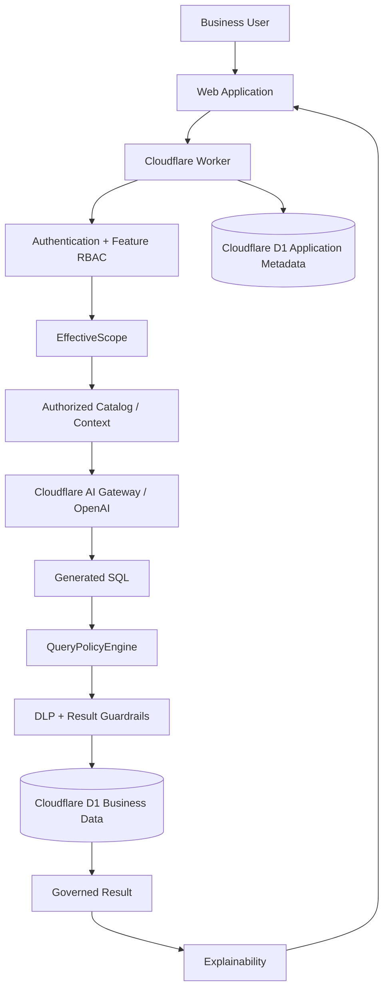

# QueryMind

> Governed enterprise AI data query platform for secure natural-language access to business data with policy enforcement, semantic context, and explainable results.

QueryMind is an AI-powered data query platform designed to help business users ask questions in natural language and retrieve answers from enterprise data without bypassing existing governance controls.

Rather than treating NL2SQL as the final product, QueryMind is evolving toward a **Governed Enterprise Data Query Layer** — a controlled runtime between enterprise identity, business semantics, AI reasoning, SQL execution, and trusted answers.

---

## Overview

Traditional enterprise data access often requires business users to:

1. Define a question.
2. Ask IT or data teams for support.
3. Wait for SQL, reports, or dashboards to be created.
4. Validate whether the result actually matches the intended business definition.

QueryMind reduces this decision latency by allowing authorized business users to interact directly with governed enterprise data through natural language.

The core design principle is:

```text
Natural Language
        ↓
Enterprise Identity
        ↓
Effective Data Scope
        ↓
Authorized Schema / Context
        ↓
AI Reasoning
        ↓
Deterministic Query Policy
        ↓
Read-only Data Execution
        ↓
Explainable Result
```

The AI is responsible for understanding the user's request, reasoning over authorized context, and generating a query.

Authorization and data governance remain enforced by deterministic application policies outside the LLM.

---

## Architecture

The current primary runtime is based on Cloudflare Workers and Cloudflare D1.



### Runtime Flow

```text
Business User
      ↓
Authentication
      ↓
Feature RBAC
      ↓
EffectiveScope
      ↓
Authorized Catalog / Context
      ↓
AI Reasoning
      ↓
Generated SQL
      ↓
QueryPolicyEngine
      ↓
DLP / Result Guardrails
      ↓
Cloudflare D1
      ↓
Governed Result
      ↓
Explainability
```

---

## Core Architecture Principles

### Governance Before AI Execution

QueryMind does not rely on the LLM to determine whether a user is authorized to access specific data.

Instead:

```text
Identity
    ↓
EffectiveScope
    ↓
Authorized Context
    ↓
LLM
    ↓
QueryPolicyEngine
    ↓
Database
```

This architecture is designed around a simple security rule:

> Even if the LLM generates an incorrect or malicious query, it must not be able to access data outside the user's authorized scope.

---

### EffectiveScope

Each request is resolved into an effective data authorization scope before data context is exposed to the model or SQL is executed.

Conceptually:

```text
User
  ↓
Role
  ↓
Data Scope
  ↓
EffectiveScope
  ↓
Allowed Tables
Allowed Columns
Row Restrictions
Export Permissions
```

The same authorization boundary is reused across supported query paths instead of implementing independent access-control logic in each module.

---

### QueryPolicyEngine

The `QueryPolicyEngine` acts as the central deterministic SQL governance boundary.

It is responsible for enforcing controls such as:

- Read-only query enforcement
- Table authorization
- Column authorization
- Row-level policy enforcement
- Unsafe SQL rejection
- Query complexity restrictions
- Result limits
- DLP-related safeguards

Query paths should not bypass this policy layer.

---

### Authorized Model Context

The LLM should only receive context that the current user is authorized to access.

```text
Enterprise Identity
        ↓
EffectiveScope
        ↓
Authorized Schema
        ↓
Authorized Semantic Context
        ↓
LLM
```

Unauthorized database metadata should not be exposed to the model and then blocked only after SQL generation.

---

### Explainable Results

QueryMind is designed to return more than a final answer.

A governed query can provide supporting context such as:

- Query understanding
- Data sources
- Governance status
- Calculation explanation
- Result summary
- Caveats
- Capability-gated SQL
- User feedback

This helps users understand how an answer was produced rather than treating the AI response as an opaque result.

---

## Technology Stack

| Layer | Technology |
|---|---|
| Edge Runtime | Cloudflare Workers |
| Application Metadata | Cloudflare D1 |
| Business Data | Cloudflare D1 |
| Frontend | Web SPA |
| AI Gateway | Cloudflare AI Gateway |
| LLM Provider | OpenAI |
| Language | TypeScript |
| Deployment | Wrangler |
| Governance | EffectiveScope + QueryPolicyEngine |
| Data Protection | DLP + Result Guardrails |

---

## Product Direction

QueryMind started from an NL2SQL use case but is evolving beyond direct natural-language-to-SQL generation.

The long-term architecture direction is:

```text
Governed Query Safety
        ↓
Explainable Query Experience
        ↓
Governed Semantic Layer
        ↓
Structured Query Intent
        ↓
Query Planning
        ↓
Evaluation
        ↓
Audit Replay
        ↓
Enterprise Data Query Layer
```

The goal is not simply to generate SQL faster.

The goal is to reduce the time between a business question and a **trusted, governed, explainable answer**.

---

## Current Development Focus

Current development focuses on establishing a reliable governed query foundation, including:

- Enterprise-oriented authentication and RBAC
- Effective data scope resolution
- Table / column / row-level query policies
- Authorized schema context
- Centralized SQL policy enforcement
- Read-only database execution
- DLP and model-egress protection
- Explainable query results
- Query feedback
- Production fail-closed safeguards

Future iterations will expand the semantic and evaluation layers without weakening the deterministic governance boundary.

---

## Security Philosophy

QueryMind follows a defense-in-depth model:

```text
Authentication
      +
Feature RBAC
      +
EffectiveScope
      +
Authorized Context
      +
QueryPolicyEngine
      +
DLP
      +
Result Guardrails
      +
Audit / Explainability
```

Prompts are not treated as security controls.

Instructions such as:

```text
Only query authorized tables.
```

may help guide the model, but actual authorization is enforced outside the LLM.

---

## QueryMind

**Governed AI access to enterprise data — from natural-language questions to secure, explainable results.**
