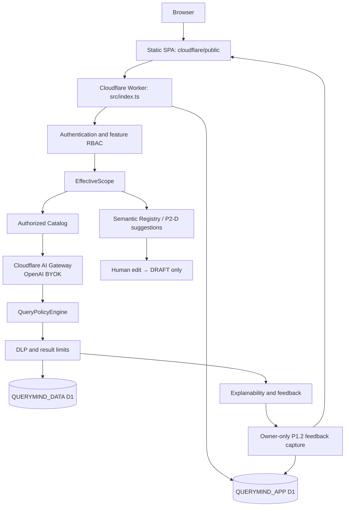

# QueryMind Current Production Architecture

## Runtime branch

The Worker authenticates the request and applies feature RBAC. It resolves EffectiveScope before it builds an authorized catalog for model context or SQL authorization. The LLM is an egress dependency through AI Gateway only; its output is untrusted. QueryPolicyEngine is the single read-only execution authorization boundary for chat, direct query, saved insight, and export. DLP and result bounds remain enforced before data returns to the SPA.

## Design-time branch

Semantic Registry and P2-D AI Suggestions live in `QUERYMIND_APP`. Suggestions receive only an authorized, selected catalog and are validated before they can become a human-owned **DRAFT**. No semantic approval or runtime semantic consumption is enabled in this phase. `registry_version` is currently `0`.

## Protected boundaries

- Authentication and feature RBAC do not grant physical data access.
- EffectiveScope controls both authorized metadata and SQL execution policy.
- The Authorized Catalog excludes unauthorized tables, columns, scope keys, and row predicates before model egress.
- QueryPolicyEngine denies invalid/read-write/unauthorized SQL; LLM output never overrides it.
- Explainability is generated from deterministic governed runtime state and SQL display remains capability-gated.
- Feedback is owner-only, successful-query-run-only and idempotent. P1.2 validates evidence targets against the persisted Explainability envelope and stores only bounded untrusted correction text; submission never calls AI or executes business SQL.

See [the governed baseline](../baselines/governed-query-baseline.md) for test-backed invariants and [the release manifest](../releases/manifests/p2-d-production.json) for production evidence.
