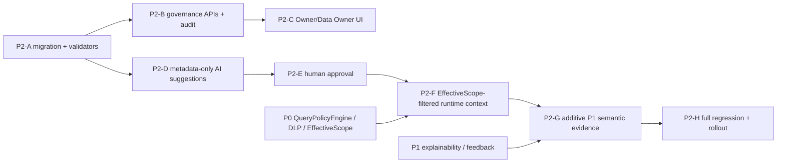

# QueryMind P2 — Implementation Impact Report
**Status:** Architecture/implementation preparation only. No source code, migration, prompt, frontend, runtime configuration, or deployment was changed for P2 in this task.

**Protected baseline:** P0 Governed Query Safety Core, P1 Explainable Query Experience, and P1.1 production-quality behavior remain authoritative. The current repository is authoritative over older release prose.

## Scope and evidence

The current Worker is `cloudflare/src/index.ts` with routes for chat, direct query, schema refresh/read, dictionary, templates, insights, export, auth/RBAC, audit, and feedback. `routes/agent.ts` resolves `EffectiveScope` before `schemaContext`/glossary, sends bounded content through AI Gateway/OpenAI, validates tool SQL through `authorizeQuery`, runs DLP, and executes only `validated.executionSql`. `routes/query.ts` and `routes/modules.ts` export/insight paths use the same policy boundary. `schema-catalog.ts` reads only DDL metadata from `QUERYMIND_DATA.sqlite_schema` for the Owner/DBA refresh operation.

The app database ends at migration `0007_explainable_query_experience.sql`; the read-only business database is data migration `0001_initial_business_schema.sql`. There is no current semantic registry, semantic revision, metric contract, or P2 runtime context.

## Component impact matrix

| Component | Current Behavior | P2 Change | Risk | Backward Compatibility | Security Impact | Test Coverage Required |
|---|---|---|---|---|---|---|
| **D1 schema** | `QUERYMIND_APP` stores users/RBAC, schema catalog, dictionary, templates/insights, policy state/scopes, DLP, query runs, audit, usage, and feedback. App migrations are forward-only through 0007; `QUERYMIND_DATA` is the read-only business schema at data 0001. | Add an additive `0008+` app migration for `semantic_assets`, `semantic_revisions`, normalized source references, aliases, relationship keys, and reviews. Use JSON-valid/check/unique/FK/index constraints and bounded payloads. Do not change 0001–0007 or data 0001. | SQLite cannot enforce every cross-row semantic invariant or immutable-row rule; circular asset/current-revision references and approval races require Worker transactions. Oversized contracts/context can consume D1/Worker budgets. | Existing tables/APIs remain intact. New tables may start empty. Legacy dictionary entries are not silently promoted. Old Worker code can ignore unused additive tables. | `ON DELETE RESTRICT`/no hard delete preserves approved historical meaning. Foreign keys prevent orphaned evidence. No data DB write path is introduced. | Disposable D1 applies all migrations in order; inspect JSON/CHECK/FK/unique/index constraints; concurrency/approval race; no 0006 rewrite; health still reports policy 0006 and feedback table. |
| **Schema catalog** | `refreshSchemaCatalog` introspects `QUERYMIND_DATA.sqlite_schema`, excludes D1/internal tables, replaces app catalog tables, and records `schema_catalog_state`. `schemaContext` filters tables/columns/FKs by `EffectiveScope` and bounds context to 32,000 characters. | Reuse catalog snapshot/version as design-time evidence and semantic source validation. Store a snapshot marker on each revision. Add no semantic authority to physical FK metadata. Runtime semantic context must recheck source existence and scope against the current catalog. | Catalog refresh can drop/rename fields; FK parser/tokenizer is bounded. Treating FK presence as business truth or using stale metadata could produce false joins. | Existing schema refresh/read APIs and context format continue to work. Semantic registry is additive and can fall back to schema/glossary if the feature flag is off. | Design-time AI receives DDL metadata only; full catalog is never sent before scope. Dropped/unauthorized source causes fail-closed omission, never fallback to broad context. | Refresh/catalog parser tests; stale/dropped table/column; unauthorized FK endpoint; context-size bounds; malicious DDL/comment injection; existing schema/RBAC E2E. |
| **Dictionary / glossary** | `dictionary_entries` has term/definition/category/examples and Owner/DBA CRUD. `businessGlossary` reads a bounded recent set, redacts/bounds text, checks referenced tables/columns against scope, and sends a legacy glossary block to chat. | Keep dictionary API/table/UI as a compatibility facade. Optionally allow explicit DBA promotion of an entry into a `TERM` DRAFT; do not auto-approve formulas. During coexistence, preserve the existing glossary output and scope checks. | Duplicate/conflicting terms, accidental assumption that free text is executable semantic truth, and breaking existing prompts/UI. | No breaking API or table change. Seeded revenue/orders/customers entries continue working. A future adapter may merge approved TERM context without removing legacy entries until parity is proven. | Dictionary content remains untrusted model context. It cannot add authorization, row policies, secrets, or semantic approval. Source-backed entries are scope-filtered; source-free terms are bounded vocabulary only. | Existing dictionary CRUD/list/delete tests; legacy seeded glossary behavior; promotion-to-draft tests; alias conflicts; prompt injection; unauthorized source omission; UI backward compatibility. |
| **Agent prompt / context** | `routes/agent.ts` builds a system prompt with bounded authorized schema, legacy glossary, history, and explicit untrusted-database instructions. It uses AI Gateway/OpenAI and a single read-only SQL tool call, then a final answer call. | Add an internal `authorizedSemanticContext(env, scope, prompt)` after scope resolution. Append only approved, relevant, transitive-scope-filtered Terms/Dimensions/Metrics/Relationships with stable asset/revision IDs and bounded contracts. Keep P0 prompt rules and model tool contract unchanged. | Context inflation, accidental registry dump, semantic IDs/definitions leaking unauthorized dependencies, stale revisions, or treating semantic text as instructions. | When feature flag is disabled/failed, existing schema/glossary prompt remains unchanged. No new public context endpoint or second runtime provider call. | EffectiveScope must precede semantic retrieval. Model is not an authorization boundary; all output remains untrusted and still goes through QueryPolicyEngine/DLP. No rows/secrets/predicates/scope keys. | Context selection/budget tests; transitive dependency omission; approved-only status; prompt/DDL injection; no full registry; AI Gateway failure; existing chat two-call/tool behavior and P0 redaction suite. |
| **EffectiveScope** | `resolveEffectiveScope` checks policy state expected migration 0006, active scope rows, allowed columns, validated row filters, and capability-derived query/export flags. It is resolved before schema/glossary and before SQL authorization. | Add semantic filtering as a consumer of `EffectiveScope`, never a producer. A metric/dimension/relationship with any unauthorized source/dependency is unavailable; source-free TERM is limited to safe vocabulary. Add no semantic row policy or scope key field. | A partial dependency filter could expose a forbidden column through a metric formula or relationship. Scope changes between draft/approval/runtime could be mishandled. | P0 scope tables/row filters/policy state stay unchanged. Semantic feature can be disabled without changing current query authorization. | This is the critical P2 boundary: no semantic asset expands data access; no full registry before scope; fail closed on missing/stale policy/catalog. | Full matrix: unauthorized table/column for every asset type, transitive dependencies, row-policy scope, policy state unavailable, scope switching, draft/deprecated exclusion, prompt injection independence. |
| **QueryPolicyEngine** | `authorizeQuery`/`authorizeReadOnlySql` validates read-only SQL, catalog sources, columns/wildcards, joins/complexity, rewrites deterministic row predicates, reapplies SQL bounds, and returns `validated.executionSql`. It is used by chat, direct query, insight create/update, and export. | No semantic bypass or rewrite of the engine. Future P2 context may guide model naming only. A later compiler/planner must produce a candidate SQL string that enters the same authorization function. | New semantic metadata might tempt a direct “approved metric executor” or raw expression execution. Structured contracts could drift from tokenizer/parser limitations. | Existing SQL semantics, error codes, limits, and execution sites remain unchanged. P2 adds no direct D1 executor and no write support. | Preserves the strongest invariant: LLM output and semantic contracts cannot override table/column/row policy, DLP, or read-only restrictions. | Existing complete P0 security suite; source-path audit; semantic “approved metric still unauthorized” tests; arbitrary SQL/raw expression rejection; no alternate executor test. |
| **Audit** | `lib/audit.ts` writes bounded JSON metadata to `audit_events`; existing routes audit query, feedback, dictionary, insight, role, invitation, API key, schema/product actions. | Reuse the same helper for suggestion generated, draft/revision updates, review submission, approval, rejection/request changes, deprecation, and optional dictionary promotion. Metadata includes IDs/status/release identity only. | Free-form prompts/comments, contracts, source predicates, or credentials could be copied into audit logs; event volume could grow. | Existing event names and audit UI/API remain. P2 events are additive and bounded; no existing audit retention semantics are redefined. | Explicitly prohibit secrets, rows, raw predicates, scope keys, credentials, unbounded prompts/comments. Approval history remains auditable without becoming an exfiltration channel. | Event presence/actor/capability tests; metadata redaction and byte bounds; no sensitive strings; review concurrency; existing audit E2E and retention behavior. |
| **Explainability** | P1 builds a deterministic `version: "p1"` envelope only after successful policy/DLP execution, persists it in `query_runs.explainability_json`, gates raw SQL by `view_schema`, and never exposes scope keys/predicates/secrets. | Add a future additive `semanticEvidence` list of exact asset/revision IDs plus semantic release identity only when approved revisions actually participate in a successful governed run. Do not rewrite historical P1 envelopes. | Storing only a current metric label would make history ambiguous; attaching draft/unavailable revisions or exposing full contracts could mislead users. | Existing P1 JSON/API/UI remains valid. New fields are optional and ignored by old clients. Historical query runs keep their original explainability. | Evidence is deterministic runtime state, not a second LLM explanation. It must not include unauthorized source details, raw policy, credentials, or unbounded contract data. | P1 explainability/feedback regression; successful-only evidence; exact revision immutability; failed/rejected/no-tool paths; SQL capability gate; owner/idempotent feedback; migration JSON check. |
| **Admin / Owner UI** | `public/app.js` exposes schema, dictionary, templates, insights, usage, source, and RBAC/admin/audit/system pages. Dictionary and schema refresh are capability-gated in UI and rechecked in Worker. | Add a compact Semantic Registry and separate AI Suggestions view for Owner/Data Owner. Show type/domain/owner/status/revision, contract/source, validation and review history. Add only required capability labels/actions; approved revisions are read-only. | UI could visually imply AI suggestion is approved, leak forbidden source/policy details, or create an entire new RBAC model. | Existing menu/routes/pages remain. No whole-app redesign. Legacy dictionary UI continues to edit compatibility entries. Semantic pages are hidden when capability is absent, but server checks remain authoritative. | Display only authorized source labels and bounded contracts; never scope keys, raw predicates, secrets, rows, or full prompts. Clear “AI suggested” vs “Enterprise approved” state. | Desktop/mobile UI/E2E; capability denial; draft vs approved distinction; safe escaping; no sensitive fields; existing menu/RBAC/dictionary/schema flows remain green. |
| **Runtime query** | Chat and direct query resolve scope, authorize candidate SQL, execute validated SQL on `QUERYMIND_DATA`, apply DLP/result budgets, then persist run/explainability. No semantic planner exists. | Append authorized semantic context before model call. Do not change the candidate SQL tool, execution order, DLP, limits, or P1 run creation. Semantic IDs may be carried as internal context/evidence only. | Semantic guidance could bias the model toward unsupported formulas/joins or introduce another execution path. | Existing no-tool conversations, direct `/api/v1/query`, streaming chat, and error behavior remain. Feature flag rollback returns to current flow. | Policy remains mandatory even for an approved metric. Semantics never authorize or execute data; prompt injection and database values remain untrusted. | Chat/direct governed paths; unauthorized/manual SQL; no semantic context path; result/DLP/row/byte limits; streaming error; policy/source-path audit. |
| **Saved insights** | `insights` stores user-owned prompt/chart/optional SQL. Create/update calls `authorizeQuery`; the UI re-runs saved SQL through `/api/v1/query`. Deleting is owner-scoped. | Do not store semantic truth in an insight. Optional future metadata may record a selected semantic revision, but stored SQL remains re-authorized at create/update and every execution. | A saved metric/revision could be treated as permanent authorization or a stale contract could silently change insight results. | Existing insight schema/API/UI and ownership stay unchanged. Any semantic reference must be optional/additive and historical. | Current scope/policy revalidation remains the security boundary; deprecation/permission changes cannot be bypassed by an insight. | Existing insight create/update/run tests; scope changes invalidate unauthorized SQL; optional stale/deprecated semantic reference; no direct executor. |
| **Export** | `/api/v1/export/csv` requires `export`, resolves `EffectiveScope`, rate-limits, authorizes SQL, applies DLP/masking and 2 MB/row limits, then streams CSV and audits. | No independent semantic export authorization. If a future UI exports a governed result, it must reuse the same validated SQL/query boundary and current scope. Semantic metadata is not exported as data policy. | A new semantic endpoint could accidentally authorize export based on asset approval or omit DLP/limits. | Existing export endpoint/CSV format/limits/audit unchanged. | Export remains governed by capability + scope + QueryPolicyEngine + DLP; semantic approval never grants export rights. | Existing export tests; unauthorized asset/SQL; DLP and formula injection; limits/rate; audit; source-path audit that no second export executor exists. |
| **Product/RBAC capabilities** | Finite capabilities in `lib/product.ts` and `role_definitions` include chat/schema/dictionary/templates/insights/export/admin operations. UI labels mirror the finite list; server rechecks all routes. | Add the smallest new design-time capabilities, preferably `view_semantics`, `manage_semantic_drafts`, `approve_semantics`, and optionally `generate_semantic_suggestions`. Seed only after product review. | Capability typo/role explosion, approval assigned to a broad role, API key gaining browser-only actions. | Existing role names, wildcard Owner behavior, role APIs, and `requireBrowserSession` patterns stay. New capability values are additive and validated by the existing finite list. | Separate viewing, drafting, suggestion generation, and approval; no capability can override data scope. | Role matrix, API key/browser-session denial, Owner/DBA/analyst/viewer E2E, unknown capability rejection, UI/server mismatch tests. |
| **AI schema intelligence** | Current AI Gateway/OpenAI calls are runtime chat completions; no design-time suggestion endpoint exists. `schema refresh` is metadata-only and Owner/browser-session gated. | Add a separate bounded metadata-only suggestion operation using existing Gateway egress/header/redaction patterns. Parse structured suggestions as untrusted DRAFTs; record model/prompt/schema release identity. | DDL/comment injection, accidental row sampling, Gateway outage, model output not matching contract, rate/cost spikes, AI self-approval. | Runtime chat behavior and provider configuration stay unchanged. Suggestion operation is optional and can be disabled independently. | No rows/secrets/tokens/predicates/scope keys; no AI approval; no permission/policy fields in contract; bounded input/output/rate. | Request payload inspection; mocked Gateway; malformed output; injection; no business D1 read except catalog DDL; rate/byte bounds; audit redaction. |
| **Tests / tooling** | Existing checks include typecheck, unit/P0/P1, product/RBAC E2E, disposable D1 through 0007, Worker startup/dry-run, frontend syntax, and source-path audit. | Add semantic unit/security/API/UI/migration tests and keep all existing suites unchanged/green. Add an explicit semantic execution-path audit and migration bootstrap 0008+ only in the later implementation. | False confidence if only happy-path contract tests run; migration drift; test fixture accidentally approves unauthorized sources. | Existing scripts remain; P2 tests are additive. No dependency installation is needed for this design task. | Tests become the regression barrier for “semantic authorization != data authorization,” fail-closed behavior, and P0/P1 boundaries. | A–L strategy in SDD Section 28; P0/P1 full regression; disposable D1; E2E; startup/dry-run; diff/source audit; release evidence. |

## Cross-cutting sequencing and dependency graph

The critical dependency is P2-F: it must not start until persistence, deterministic validation, and approval are proven. P2-G must not start until the Worker can persist the exact approved revision IDs used by a successful governed run. At every stage, disabling the feature returns the product to the current P0/P1 behavior.

## Required architecture invariants for implementation

1. No direct `QUERYMIND_DATA` business execution outside the current governed execution boundary.
2. No full schema, dictionary, or semantic-registry exposure before `EffectiveScope`.
3. No LLM-based authorization, semantic approval, row policy, or data-scope decision.
4. No arbitrary SQL or AI-authored row predicate becomes an approved Metric Contract.
5. No independent export authorization implementation.
6. No write-enabled AI SQL, ETL, external connector, or planner in P2.
7. Only approved revisions enter runtime semantic context; deprecated revisions remain historical only.
8. Unauthorized transitive dependencies remove the entire asset, not merely a source field.
9. P1 explainability remains successful-run-only, deterministic, capability-gated, and free of scope keys/raw predicates/secrets/credentials.
10. Dictionary, saved insight, template, and database content remain untrusted/compatibility inputs; none becomes permanent authorization.
11. Context, contract, audit, and API payloads are bounded for Worker/D1/Free-plan operation.
12. Q82–Q85 remain extension points, not P2 feature decisions.

## Impact conclusion

P2 is a substantial additive metadata/governance capability, but it does not require replacing the current query runtime. The safest implementation order is persistence/validation → review APIs/audit → UI → metadata-only AI drafts → human approval → scope-filtered context → optional P1 evidence. The main blocker is not a missing technology; it is architecture review of the proposed contract/capability names and explicit approval before creating migration 0008+.
