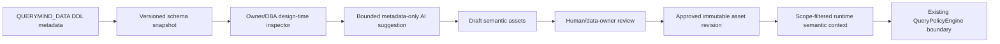

# QueryMind P2 Governed Semantic Foundation Investigation
Status: investigation only. No P2 feature, migration, API, prompt, or runtime execution change is included in this document.

This investigation is based on the post-P1 source tree, `docs/baselines/governed-query-baseline.md`, the P0/P1 SDD and release documents, `cloudflare/src`, the current Worker configuration, and application/data migrations 0001 through 0007. The repository is authoritative. A referenced production activation document is not present under `docs/releases` in this checkout; production configuration therefore remains evidenced by the Worker configuration and runtime code rather than by that absent document.

## Current State

QueryMind is a Cloudflare Worker with two D1 bindings. `QUERYMIND_DATA` is the read-only business database and `QUERYMIND_APP` stores identity, product metadata, governance metadata, audit records, query runs, and feedback. A request authenticates first, receives an `EffectiveScope`, obtains a scope-filtered schema context, calls OpenAI through the Cloudflare AI Gateway, validates the generated SQL with the central `QueryPolicyEngine`, masks results through DLP, and executes only the governed execution SQL against D1.

The current semantic contract is intentionally thin. The model receives bounded schema metadata and bounded business glossary text, but there is no approved metric registry, dimension registry, relationship contract, grain contract, versioned semantic asset, or human approval state. P1 explainability describes deterministic runtime facts from the executed query; it is not a semantic model.

## Existing Semantic-like Components

### Schema catalog

`schema_catalog_state`, `schema_catalog_tables`, `schema_catalog_columns`, and `schema_catalog_foreign_keys` are the closest existing metadata layer. `refreshSchemaCatalog` introspects `QUERYMIND_DATA.sqlite_schema`, excludes internal tables, parses columns and foreign keys, and replaces the catalog snapshot in `QUERYMIND_APP`. Table/column descriptions are currently storage fields, not an approved semantic definition system. The catalog is used by the policy engine and by `schemaContext`, not as an authority for business formulas.

### Business dictionary

Migration 0004 creates `dictionary_entries` and seeds terms such as revenue, orders, and customers. DBA-capability routes can create, edit, and delete entries. `businessGlossary` reads a bounded recent set and filters references through the effective scope before sending it to the model. Entries have term, definition, category, examples, timestamps, and updater identity, but no draft/approved/deprecated status, version, source lineage, formula contract, grain, or review record. Dictionary text is therefore useful context but cannot safely be treated as executable semantic authority.

### Static display and heuristic labels

The explainability module contains a small code-versioned table label map and approved display labels for common aggregate columns. The P1.1 UI adds a safe display fallback for result aliases. These are presentation and bounded explanation aids, not governed semantic assets, and they must not change SQL authorization.

### Templates and insights

`query_templates` stores reusable prompts and descriptions. Templates are product content, not semantic definitions. `insights` stores user-owned prompt, chart type, and optional SQL. SQL is authorized at write time and re-authorized at execution time; saving an insight never grants permanent authorization. Neither table defines a trusted metric or relationship.

### Foreign-key metadata

The catalog records physical foreign-key endpoints discovered from SQLite DDL. It does not record business relationship meaning, cardinality, join direction, nullability policy, preferred join path, or whether a relationship is approved for analytics.

## Reusable Components

The following should be reused by a future P2 design:

1. `refreshSchemaCatalog` and its bounded D1 metadata extraction, as the source snapshot for design-time inspection.
2. `schemaContext` and the existing `EffectiveScope` filtering order. Semantic assets must be filtered after scope resolution and before any model context is assembled.
3. `businessGlossary` redaction, bounding, and source-column checks as a compatibility bridge for existing dictionary content.
4. Existing authentication, Owner/DBA capabilities, audit events, and `QUERYMIND_APP` storage for review ownership and history.
5. The existing `gatewayCompletion`/AI Gateway egress boundary for optional design-time suggestions, with a separate Owner-only operation and no business-row payload.
6. Query runs and P1 explainability as immutable runtime evidence; future semantic references must be additive metadata, not a replacement for the governed SQL trace.

No P2 design should reuse `dictionary_entries` as an implicit authorization source or treat an LLM suggestion as an approved semantic rule.

## Design-time AI Schema Intelligence

The safe design-time flow is:



The inspector may propose names, descriptions, candidate source columns, possible dimensions, and relationship hypotheses from DDL metadata and approved dictionary text. It must not receive business rows, secrets, row-policy predicates, credentials, or unrestricted schema. Suggestions remain drafts until a human with an explicit management capability approves them. The AI is a recommender, never the approval authority.

## Candidate Semantic Asset Model

The model should be a versioned, append-only revision stream rather than mutable text that silently changes historical meaning. Candidate common fields:

| Area | Candidate fields | Open design question |
| --- | --- | --- |
| Identity | `asset_id`, `asset_type`, stable slug, domain | Are slugs globally unique or scoped by workspace/domain? |
| Lifecycle | `status` (`draft`, `suggested`, `approved`, `deprecated`), `version`, `supersedes_asset_id` | Can an approved revision be edited, or only superseded? |
| Ownership | owner user/team, steward, reviewer, review timestamp | Is ownership per asset or per domain? |
| Source | authorized table/column references, schema snapshot id | What normalized reference shape supports expressions and joins? |
| Meaning | label, definition, examples, synonyms | Which fields are required before approval? |
| Calculation | expression/metric contract, filters, unit, null policy | Must formula and cancellation rules be explicit for every metric? |
| Shape | grain, dimensions, time grain, cardinality | Which grain/cardinality assertions are mandatory? |
| Relationships | endpoints, join keys, direction, cardinality, approval | Can multiple approved paths coexist? |
| Governance | capabilities/scopes, allowed use, audit reason | Is asset visibility derived entirely from source-column authorization? |
| History | created/updated timestamps, change reason, review decision | How long are rejected suggestions retained? |

The first implementation should separate `metric`, `dimension`, and `relationship` types even if they share a revision table. A metric must not be approved without a deterministic source mapping and a declared grain; a relationship must not become an automatic join merely because an FK exists.

## EffectiveScope Integration

Scope resolution remains first. A future runtime catalog query should:

1. Resolve the user, role, scope key, active policy version, allowed tables/columns, row policy, and capabilities.
2. Select only approved semantic revisions whose every referenced table and column is authorized in that scope.
3. Remove a relationship if either endpoint or join column is not authorized.
4. Remove a metric if its expression, filter, or dependency references an unauthorized column.
5. Bound and redact the resulting semantic context before model egress.

No full semantic registry may be sent to the model before this filtering. A saved insight, template, dictionary entry, or model-generated text cannot expand `EffectiveScope`.

## Runtime Integration Boundary

The protected P0/P1 flow remains the boundary:

```text
Question -> EffectiveScope -> Authorized Schema/semantic context -> LLM -> candidate SQL
         -> QueryPolicyEngine -> DLP/result budgets -> governed D1 execution -> Explainability/feedback
```

P2 should add meaning to the authorized context only. It must not add a second SQL executor, a semantic bypass around `authorizeQuery`, a model-controlled row filter, or write-enabled AI SQL. Structured intent/planning and richer join planning belong to later work and require separate security review.

## P1 Explainability Integration

P1 explainability is built from deterministic runtime state: referenced tables, aggregate/grouping facts, row count, truncation, masking, and governance flags. A future successful run may record an approved semantic asset id and revision, plus the resolved asset labels used for context. These fields must be additive and immutable in the query-run record. Explainability must never expose scope keys, raw row predicates, secrets, credentials, or a draft/unapproved asset as if it were authoritative.

Historical runs must continue to render using their stored explainability and semantic revision reference even after an asset is deprecated. Feedback remains owner-only, successful-run-only, and idempotent.

## Migration Impact

No migration is proposed in this investigation. If P2 is approved, an additive migration after 0007 will likely need:

- schema snapshot identity and provenance;
- semantic asset identity plus immutable revisions;
- source table/column references and dependency indexes;
- metric calculation, grain, unit, and filter contracts;
- dimension and relationship contracts;
- lifecycle, ownership, reviewer, approval decision, and deprecation records;
- audit events and query-run references to the exact approved revision.

Existing dictionary entries should coexist during transition. A later migration must define how legacy entries are imported as drafts or compatibility glossary records; it must not silently promote free text to an approved metric. Existing `query_templates` and `insights` remain product content and must continue to be re-authorized at runtime.

## Security Model

- Design-time inspection is Owner/DBA-only and browser-session-only.
- The inspector receives DDL metadata and bounded approved glossary text, never business rows or credentials.
- AI suggestions are untrusted drafts and cannot publish, authorize, execute, or alter row policies.
- Approval requires a human with an explicit capability and produces an auditable immutable revision.
- Runtime semantic context is derived only from approved revisions and filtered by `EffectiveScope`.
- Source references, formulas, join keys, and glossary content are untrusted input until validated against the catalog and policy model.
- Model output remains a candidate; all SQL still passes the central QueryPolicyEngine, DLP, row limits, and read-only boundary.
- Production configuration remains fail-closed; no secret or raw governance predicate enters model context or explainability.

## Human Approval Workflow

1. Owner/DBA selects a current schema snapshot and requests a metadata-only suggestion set.
2. The system stores each suggestion as `suggested` with source snapshot, model metadata, and bounded rationale.
3. A data owner reviews source mappings, formula, grain, filters, unit, relationship keys, and scope impact.
4. The reviewer either rejects it with a reason or publishes an immutable `approved` revision.
5. A later change creates a new revision and deprecates the prior revision; historical query runs retain their original reference.
6. Runtime dashboards and P1 explainability show only the approved revision and its deterministic source facts.

## Q65 — Relationship metadata timing

Option A introduces formal relationship metadata in the first P2 slice. It improves join correctness and explainability but increases review burden, migration shape, and scope-filtering complexity. Option B defers relationships and limits P2 to metrics/dimensions sourced from a single table or explicit existing joins. Option B is safer for a first semantic release; formal relationships should be a clearly bounded follow-up once the approval and dependency model is proven. Product and data-owner decision required.

## Q66 — Cardinality and grain

Requiring grain and cardinality at approval time prevents ambiguous aggregation and fan-out joins, but makes approval slower and may reject useful descriptive dimensions. Making them optional lowers adoption but leaves the most dangerous semantic ambiguity unresolved. Recommendation: require metric grain and aggregation unit in the first approved metric contract; make relationship cardinality mandatory before a relationship can participate in automatic planning. Product decision required.

## Q67 — Machine-readable metric contract

Option A stores a machine-readable metric expression, dependency list, filter policy, unit, and grain. This enables deterministic validation and later planning, at the cost of a more complex review UI and migration. Option B stores only labels/descriptions and leaves formulas to the model, which is simpler but not safe for governed analytics. Recommendation: choose Option A for approved metrics; descriptive-only entries remain glossary content and cannot claim calculation authority. Product decision required.

## Golden Use Case

“List sales amount by product, excluding cancelled orders.” The current system can expose the authorized `products`/`order_items` schema, dictionary text about revenue, and a governed query result. It does not currently guarantee that `sales amount` has an approved formula, that the metric grain is order-item subtotal, that cancellation exclusion is an approved reusable rule, or that a product/order-item join is the preferred relationship. P2 must make those facts explicit, reviewable, versioned, scope-filtered, and traceable in explainability without changing the P0 execution boundary.

## Recommended Next Step

1. Resolve Q65, Q66, and Q67 with the product/data owner.
2. Freeze the P2 semantic requirements and security invariants.
3. Write a P2 SDD covering the approved asset model, lifecycle, scope filtering, and migration compatibility.
4. Review the SDD against the frozen P0/P1 baseline.
5. Only after approval, implement the design-time draft/review flow and its tests; do not begin runtime planner or automatic join work in the same slice.
