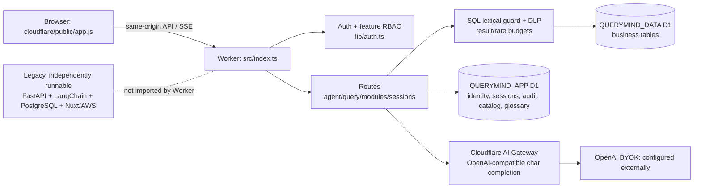

# QueryMind Codebase Gap Analysis

**Audit date:** 2026-08-21  
**Scope:** whole repository, read-only inspection. Code was treated as authoritative; deployment claims in documentation were not treated as runtime proof. No source, configuration, migration, dependency, or cloud resource was changed.

## 1. Executive Summary

QueryMind is architecturally a **Cloudflare-hosted, single-D1 NL2SQL application with product-level RBAC and DLP controls**. `cloudflare/wrangler.jsonc` declares the only Worker deployment entry point (`src/index.ts`), two D1 bindings, and static assets in `cloudflare/public`. `cloudflare/README.md` calls this the replacement runtime. The repository nevertheless retains a separately runnable FastAPI/Nuxt/PostgreSQL/AWS product; it is not imported by the Worker and must be treated as a legacy deployment path until an operator proves it is retired.

It is closer to an **enterprise-oriented AI query product** than a basic NL2SQL demo: it has login, invitations, API keys, feature RBAC, session ownership, audit rows, DLP masking, CSV controls, schema discovery, rate limits, and a documented release process. It is **not yet a governed enterprise query runtime** because identity is not transformed into a data scope before schema retrieval or execution.

Top strengths:

1. Deterministic Worker controls precede D1 execution: authentication, capability check, session ownership, rate limits, SQL guard, DLP and result budget (`cloudflare/src/routes/agent.ts`, `routes/query.ts`).
2. A real read-only SQL boundary blocks multi-statement SQL, comments, DML/DDL tokens, recursive CTEs and several resource-amplifying functions, then applies an outer row limit (`cloudflare/src/lib/sql.ts`).
3. Sensitive projection/inference handling is deliberately conservative and is reused by Agent, direct query and CSV export (`cloudflare/src/lib/dlp.ts`, `routes/modules.ts`).
4. Authentication uses signed HttpOnly same-site cookies or hashed API keys, password peppering, credential-version JWT invalidation, invitation atomicity, and browser-only admin operations (`cloudflare/src/lib/auth.ts`, `routes/invitations.ts`).
5. The current runtime has meaningful safety/RBAC/UI regression tests and CI uses disposable local D1 (`cloudflare/tests/*.spec.ts`, `.github/workflows/ci.yml`).

Top gaps:

1. No datasource/table/column/row policy is evaluated before schema exposure or D1 execution; all chat-capable users can execute a valid `SELECT` against the one D1.
2. The SQL guard is lexical, not AST-based, and has no data-scope policy, query timeout, cancellation, concurrency cap, cost/fan-out validation, or pagination.
3. The OpenAI path has no authorized semantic retrieval or data-classification egress policy; full catalog, glossary, prompt/history and masked data preview are sent to the Gateway.
4. Semantic governance is a mutable, shared flat glossary; there are no governed metric contracts, hierarchy, approval, version, history, grain or cardinality.
5. Evidence, feedback/evaluation, release promotion and customer-plane operations are incomplete. The checked-in Worker configuration remains `preview` with `AI_MOCK_MODE=true`, so real Gateway/OpenAI behavior is not verified by this repository.

**Incremental evolution is viable.** Keep the Worker/D1 split, route-level authorization, schema catalog, DLP/result-budget libraries and current OpenAI Gateway seam. Add a deterministic data-scope and SQL-policy core before adding more AI behavior. Do not rewrite into a multi-agent system.

## 2. Current Architecture

Evidence map:

- `cloudflare/wrangler.jsonc` binds `QUERYMIND_DATA`, `QUERYMIND_APP`, `ASSETS`, enables Worker observability and serves `public/` with `run_worker_first`.
- `cloudflare/src/index.ts` is the HTTP router; `public/app.js` is the served SPA. `frontend/nuxt.config.ts` instead targets a localhost FastAPI proxy, while `api/main.py` constructs the legacy registry/tools/scheduler/agent.
- Chat flow is `public/app.js` → `POST /api/v1/chat` → `routes/agent.ts:prepareChat/runAgent` → AI Gateway function tool → D1. Direct saved-insight SQL instead uses `/api/v1/query` and skips the LLM (`public/app.js`, `routes/query.ts`).
- App D1 schemas are in `cloudflare/migrations/app/0001`–`0005`; data D1 business schema is `migrations/data/0001_initial_business_schema.sql`.

## 3. Target Architecture Comparison

```mermaid
flowchart LR
  I[Enterprise identity] --> P[Deterministic policy decision\nfeature + datasource/table/column/row + export]
  P --> S[Authorized semantic/schema retrieval\nversioned assets]
  S --> N[Structured intent]
  N --> PL[Query plan]
  PL --> LLM[LLM reasoning node\nOpenAI]
  LLM --> V[AST SQL policy\nscope rewrite, timeout, cost/limit]
  V --> X[Read-only execution]
  X --> C[Deterministic result checks]
  C --> E[Evidence envelope + immutable run]
  E --> A[Trusted answer / feedback / evaluation]
```

The current Worker implements the highlighted deterministic controls only after identity has been mapped to a **feature capability**, not a data scope. It then retrieves the whole catalog and glossary and lets the LLM choose SQL. There is no reusable structured intent or plan between question and SQL, nor an evidence/evaluation loop.

## 4. Gap Matrix

| ID | Module | Target capability | Status | Current evidence | Gap | Risk | Priority | Recommended direction |
|---|---|---|---|---|---|---|---|---|
| M1-1 | M1 | Enterprise identity + feature RBAC | PARTIAL | JWT/API-key user lookup and `requireCapability`; roles in `0004_restore_product_modules.sql` | No SSO, department or deny-by-default config | Medium | P1 | Keep local auth; add an OIDC/SSO boundary later. |
| M1-2 | M1 | Datasource/table/column/row/export scopes | MISSING | Query requires only `chat`; catalog and SELECT cover all D1 tables | No data policy object or RLS/rewrite | High | P0 | Add policy-derived authorized catalog and execution scope. |
| M2-1 | M2 | Governed source lifecycle/read-only verification | PARTIAL | One fixed D1; schema refresh and source page | No onboarding, credential rotation, health/freshness/replica state | Medium | P1 | Preserve single D1 now; model source metadata explicitly. |
| M3-1 | M3 | Governed semantic assets | PARTIAL | Shared dictionary CRUD and schema/FK catalog | No hierarchy, metric contracts, owner/approval/version/history | Medium | P1 | Build a small versioned semantic registry. |
| M4-1 | M4 | Structured intent, ambiguity and plan | MISSING | Tool-call loop only in `routes/agent.ts` | SQL/answer selection wholly LLM-driven | Medium | P1 | Add intent + plan contract, fast-path only for safe simple queries. |
| M5-1 | M5 | AST scope/cost/timeout execution policy | PARTIAL | `lib/sql.ts`, DLP, rate/row/byte limits | Regex guard; no AST, scope, timeout/cancel, cost or pagination | High | P0 | Central AST policy service used by Agent/direct/export. |
| M6-1 | M6 | Evidence and reproducible answers | PARTIAL | SQL, bounded masked preview, run/audit/usage rows | No versioned evidence envelope, freshness, source trace or rerun-current-rules | Medium | P1 | Add metadata/result digest and distinct rerun records. |
| M7-1 | M7 | Feedback and evaluation | MISSING | Security/RBAC/UI tests only | No feedback, review queue, golden cases or real-model regression | Medium | P1 | Add approved golden/evaluation workflow; do not auto-learn. |
| M8-1 | M8 | Release/telemetry/customer planes | PARTIAL | logs/traces, health, runbook, CI dry-run | No promotion pipeline, migration-state gate, IaC/canary/customer deployment template | Medium | P1 | Release manifest + non-sensitive telemetry; control plane later. |

## 5. Module Analysis

### M1. Identity & Access Governance — 2/5

**Current implementation and strengths.** `requireUser` verifies signed session JWTs or hashes API keys and reloads the active user/role; `requireCapability` is enforced by Worker routes. Sessions are user-owned (`lib/sessions.ts`). Browser-only checks prevent even an Owner API key from entering account recovery/admin paths. The UI also filters menu items, but the API independently enforces capability.

**Gaps and concerns.** Roles contain only product capabilities and a row maximum (`migrations/app/0004_restore_product_modules.sql`). `schemaContext()` returns every catalog table/column/FK to anyone with `view_schema`, and both Agent and `/api/v1/query` execute any syntactically accepted SELECT for anyone with `chat`. There are no user/department bindings, datasource/table/column permissions, row filters, raw-data scope or bulk-export distinction. `requireUser` returns a local Owner if `AUTH_REQUIRED !== "true"` (`lib/auth.ts`); checked-in config sets it correctly, but a missing/typoed production value fails open.

**Recommended evolution / affected areas.** P0: fail closed outside local development and introduce policy bindings plus an `EffectiveScope` produced before catalog retrieval. Apply that scope to `schema-catalog.ts`, `agent.ts`, `query.ts`, and export. P1: SSO/OIDC and department mapping.

### M2. Data Source Governance — 2/5

**Current implementation and strengths.** The deliberate single-D1 boundary is explicit in `wrangler.jsonc` and `connectionInfo()`. `refreshSchemaCatalog()` reads SQLite schema metadata, extracts columns/FKs and stores a normalized catalog. The UI discloses that external sources and ETL are unsupported.

**Gaps and concerns.** The data binding is not a database-native read-only credential; read-only is enforced by application code. No allowed table/source configuration, source owner, SSL/TLS/credential lifecycle, health/freshness/replica classification, drift diff or deactivation exists. `source_schema_version` is always `d1` and refresh delete/replaces the catalog.

**Recommended evolution / affected areas.** Do not add multi-datasource support now. Add source metadata, approved table set, schema snapshot/hash and freshness to `QUERYMIND_APP`; use it from `schema-catalog.ts` and the policy core.

### M3. Semantic Governance — 1/5

**Current implementation and strengths.** `dictionary_entries` has term/definition/category/examples and CRUD is capability-gated/audited. `businessGlossary()` supplies the 20 most recently updated entries to the prompt. The schema catalog contributes columns and FKs.

**Gaps and concerns.** There is no canonical/domain/user term hierarchy, aliases, metric expression/source mapping, grain/cardinality, owner/steward/approval, lifecycle, reason, immutable revision or schema dependency. Updating/deleting a dictionary entry leaves only an event/resource ID. Templates are mutable prompt artifacts, not governed analytical assets. The legacy `core/semantic_layer.py` is not used by Worker code and cannot be credited to the current runtime.

**Recommended evolution / affected areas.** P1: a minimal approved, versioned semantic asset model (term/metric/dimension/relationship) with owner/status/reason/schema snapshot. Do not build vector search or a full ABAC engine first.

### M4. Query Intelligence Runtime — 2/5

**Current implementation and strengths.** `routes/agent.ts` has an OpenAI-compatible function-call loop: first model turn can request exactly one `run_readonly_sql`, then a bounded masked result returns to the model for a final answer. Model allowlist, prompt character limit, two provider calls maximum and a 30-second Gateway timeout exist. Provider coupling is **healthy current coupling**: Gateway calls are isolated in `gatewayCompletion()` and headers/config are in `lib/ai-config.ts`.

**Gaps and concerns.** There is no structured intent, ambiguity state, plan, bounded repair, semantic validator, deterministic numerical binding or result correctness check. A response with text but no tool call is persisted as an answer without data verification. Catalog/glossary retrieval happens before any data authorization.

**Recommended evolution / affected areas.** P1: add a typed intent and plan, ambiguity actions (ask/assume+disclose/refuse), then feed only scoped semantic context to `gatewayCompletion`. Retain one provider abstraction only if a second provider becomes a real requirement.

### M5. SQL Safety & Execution — 2/5

**Current implementation and strengths.** `validateReadOnlySql()` is consistently invoked by Agent, direct query and CSV. It rejects semicolons/comments, write/DDL tokens, recursive CTEs and listed expensive functions, accepts only SELECT/WITH and wraps the query in an outer limit. DLP blocks sensitive predicates/grouping/order/join inference and masks output conservatively. Result bytes, exports and request rates are bounded.

**Gaps and concerns.** This is not a parser/AST policy. It has no authorized tables/columns, row policy injection, statement timeout/cancel, concurrency cap, cross-join/fan-out/explain cost control, pagination or retry classification. A valid `SELECT * FROM employees` is executable by every chat user. Rate limits are not query concurrency control.

**Recommended evolution / affected areas.** P0 centralize an AST-backed policy evaluator before every `QUERYMIND_DATA.prepare()`. It must enforce the EffectiveScope, read-only AST, allowed joins/complexity, forced limit and timeout/cancellation strategy. Keep DLP as a defense-in-depth output control, not the authorization model.

### M6. Evidence & Trust — 1/5

**Current implementation and strengths.** `query_runs` records prompt/SQL/row count/duration/outcome and chat history stores a masked 25-row/32-KB preview. Usage and audit tables record basic events. UI shows rows, masks, chart and SQL.

**Gaps and concerns.** No intent/plan/terms/source/freshness/policy/semantic/schema/prompt versions, result hash, retry chain or evidence status exists. The UI has no source trace, supporting-data pagination, needs-confirmation state, immutable history or re-run-with-current-rules action. Session cleanup deletes audit/query/usage metadata after 180 days and pinned chat may retain prompts indefinitely.

**Recommended evolution / affected areas.** P1 add an evidence envelope per run: execution identity, scope/policy decision, approved semantic and schema versions, intent/plan, generated/executed SQL, freshness, bounded result digest and status. A rerun must create a new run.

### M7. Evaluation & Learning — 0/5

**Current implementation.** `cloudflare/tests/security.spec.ts`, `rbac.spec.ts` and `app.spec.ts` provide valuable regression coverage, but all model-dependent E2E is mock-based. `verification/business_queries.sql` is manual SQL without asserted expected outcomes. No feedback table, review queue, golden suite, model/prompt comparison or quality dashboard is present.

**Recommended evolution / affected areas.** P1 add a versioned golden fixture with question, allowed semantic scope, expected intent/source/filter, policy outcome and deterministic result/SQL assertions; run it with controlled fixtures in CI. Add feedback with review/root cause; only approved changes may create new evaluation cases.

### M8. Enterprise Operations — 2/5

**Current implementation and strengths.** Worker observability enables logs and sampled traces. `/health` checks both bindings and AI readiness. `ai_usage_events` retains model/request/row/status/duration metadata. CI performs type checks, security tests, disposable-D1 E2E and a Worker deploy dry run. `PRODUCTION_RUNBOOK.md` contains good manual preflight, rollback and incident guidance.

**Gaps and concerns.** There is no automated remote deployment/promotion, migration state evidence, release version record, canary/stable channel, IaC, customer stack template, alerting or central non-sensitive telemetry pipeline. Health does not prove schema freshness, D1 migration state, real Gateway success or data correctness. Critically, `scripts/init-local-test.mjs` intentionally applies app migrations only through `0004`; DLP policies are added in `0005`. Tests therefore do not prove a deployed database has `0005`. The code adds defaults for a few names, but `phone`, `address` and `birth_date` depend on that migration.

**Recommended evolution / affected areas.** P0 add an approved, read-only migration/policy-state release gate. P1 add an immutable release manifest, non-sensitive telemetry/error taxonomy and per-customer deployment template. P2 can add a shared control plane and canary rollout.

## 6. End-to-End Query Runtime Review

| Transition | Current behavior | Classification | Evidence |
|---|---|---|---|
| User → API | SPA creates a session and calls `/api/v1/chat`; Worker can emit SSE | Deterministic | `public/app.js`, `src/index.ts` |
| API → identity/policy | JWT/API key + feature capability + owned session | Deterministic | `lib/auth.ts`, `lib/sessions.ts`, `routes/agent.ts` |
| Policy → authorized context | Whole schema catalog plus 20 global dictionary entries | Absent for data scope | `lib/schema-catalog.ts`, `routes/agent.ts:96-105` |
| Context → intent | Prompt/historical messages passed to model | LLM-driven | `routes/agent.ts:210-219` |
| Intent → plan | No typed intent or plan | Absent | no Worker contract/table/symbol found |
| Plan → SQL | OpenAI function tool selects one SQL statement | LLM-driven | `routes/agent.ts:220-230` |
| SQL → policy | Lexical read-only guard, DLP, row/result/rate budgets | Deterministic, partial | `lib/sql.ts`, `lib/dlp.ts`, `lib/result-budget.ts` |
| Policy → execution | D1 `.prepare(...).all()` | Deterministic, incomplete | `routes/agent.ts:231`, `routes/query.ts:90` |
| Execution → validation | DLP/output size only | Mixed, partial | `routes/agent.ts:232-244` |
| Validation → evidence/answer | Masked preview goes to LLM; SQL/rows persisted | Mixed, partial | `routes/agent.ts:174-189,233-238` |

## 7. Security Findings

| Severity | Finding | Exploit / failure path | Current control | Missing control | Evidence | Recommendation |
|---|---|---|---|---|---|---|
| HIGH | No data-level authorization | Any authenticated `viewer` with `chat` can select unmasked columns from any D1 table; future sensitive names are not automatically protected | Feature RBAC, DLP | Scope policy, table/column permissions, row filters/RLS | `lib/auth.ts`; `lib/schema-catalog.ts`; `routes/query.ts`; `0004` role rows | P0 EffectiveScope + authorized catalog + execution enforcement. |
| HIGH | SQL resource/data policy incomplete | Valid but costly/fan-out SQL or prohibited table access reaches D1 | lexical guard, outer limit, DLP, rate/byte caps | AST, allowed joins/tables/columns, timeout/cancel/concurrency/cost | `lib/sql.ts`; D1 calls in `agent.ts`/`query.ts` | P0 central SQL policy engine. |
| HIGH (config-triggered) | Authentication can fail open | `AUTH_REQUIRED` unset/mistyped returns local Owner | checked config is `true` | fail-closed non-local config validation | `lib/auth.ts:requireUser`; `wrangler.jsonc` | P0 reject insecure production startup/config. |
| HIGH (conditional) | DLP policy migration not covered by CI | If remote `0005` was not applied, named phone/address/birth-date policy rows are absent | a few default sensitive names | release migration/policy-state check | `scripts/init-local-test.mjs`; `migrations/app/0005_product_hardening.sql` | P0 verify and gate migration state; audit did not query remote D1. |
| MEDIUM | Prompt/indirect-injection and model egress boundary | User prompt/history, global glossary and schema go unredacted to Gateway; database result content is only textually labelled untrusted | system prompt, tool validation, masked preview | classification-aware egress/redaction, authorized retrieval, trust separation | `routes/agent.ts:81-111,206-238` | P0 scope content; P1 egress policy and injection tests. |
| MEDIUM | Reconstructability/retention mismatch | Prompts/SQL retained, audit pruned; pinned chats can remain; no configurable classification/retention | masked preview bound | retention classes, immutable evidence/digest | `routes/sessions.ts`; `agent.ts`; migrations | P1 evidence-retention policy. |
| MEDIUM | Password KDF work factor | Stored hash compromise has lower work factor than the legacy 100k KDF | salted PBKDF2 + pepper, constant-time compare | calibrated production work factor/upgrade plan | `lib/auth.ts` | P1 calibrate with Worker CPU constraints. |
| HIGH if legacy is exposed | Legacy FastAPI permits a data-modifying `WITH` path and unsafe cache scope | PostgreSQL CTE DML may be treated as read-only; cache omits identity/policy | legacy settings only | retire/isolate legacy runtime | `core/rbac.py`, `tools/db_tools.py`, `db/connector.py`, `core/query_cache.py` | P0 prove legacy endpoint is offline or patch before any exposure. |

No apparent real OpenAI/Bearer/AWS credential was found in tracked source; matches were placeholders/examples. `.gitignore` excludes `.env*` and `.dev.vars`. This is not evidence about deployed secrets.

## 8. Semantic Governance Review

Today, the Worker has a shared mutable glossary and an automatically refreshed physical schema catalog. It does **not** have canonical/domain/user terminology, semantic ownership or approval, source mappings, metrics, cardinality/grain, schema drift invalidation or semantic history. Therefore the model receives a useful prompt aid, not an authoritative semantic layer.

The smallest viable next state is an approved semantic registry attached to a schema snapshot: term/metric/dimension/relationship, owner, lifecycle, version, change reason and optional aliases. Retrieval must be filtered by EffectiveScope before the LLM. This is justified before executable metrics or semantic vector search.

## 9. Evidence & Audit Review

**Can reconstruct today:** actor/session (when persisted), original prompt, generated/validated SQL, row count, duration, outcome/error code, basic model name/request count, audit event and a bounded masked result preview.

**Cannot reconstruct today:** the policy decision/data scope, authorized catalog, intent, ambiguity, semantic definitions/version, schema snapshot/version, query plan, exact model/provider response metadata, prompt version, freshness, result hash/full result reference, retries or deterministic explanation of why the answer is correct.

Business UX exposes only result count, masking status, table/chart and SQL (`public/app.js:resultPanel`). Backend audit is stronger but neither immutable nor sufficient for an enterprise replay.

## 10. Cache Review

The active Worker has no semantic/query-plan/execution/final-answer cache. JSON, query, CSV and SSE responses use `Cache-Control: no-store` (`lib/http.ts`, `routes/query.ts`, `routes/modules.ts`, `routes/agent.ts`). `public/app.js` has a browser-memory cache for authenticated product GET views and clears it on logout; it does not cache query execution responses.

**Answer:** In the current Worker, two users cannot receive an unauthorized *cached query result*, because no shared execution-result cache exists. This does not make current data access safe: both users can query the same unscoped data directly. If legacy FastAPI is ever exposed, `core/query_cache.py` keys raw results only by connection and normalized SQL, omitting identity/policy/semantic/schema dimensions; it is unsafe once data scopes exist.

## 11. Evaluation Readiness

Current tests are strong for SQL rejection, DLP inference, auth/session/API-key boundaries and mock UI/RBAC. CI runs a local Worker in mock mode and deploy dry-run; it does not validate live OpenAI/Gateway behavior, golden NL2SQL correctness, semantics, row scope, freshness or feedback. Minimum viable evaluation: versioned fixture cases backed by deterministic D1 data, expected semantic scope/intent/policy outcome/SQL-or-result assertion, and a reviewed feedback-to-golden promotion process.

## 12. Capability Scorecard

| Module | Score | Rationale |
|---|---:|---|
| M1 Identity & Access | 2 | Usable local identity and feature RBAC; no enterprise/data-level authorization. |
| M2 Data Source | 2 | Single D1, schema discovery and refresh; no governed source lifecycle. |
| M3 Semantic | 1 | Shared glossary and physical catalog only. |
| M4 Query Runtime | 2 | Bounded tool-call loop, but no intent/plan/ambiguity/correctness contract. |
| M5 SQL Safety | 2 | Solid baseline guard/DLP/budgets; no AST or data scope/timeout/cost policy. |
| M6 Evidence & Trust | 1 | Basic audit and SQL preview, not reproducible trusted evidence. |
| M7 Evaluation & Learning | 0 | No product evaluation or feedback workflow. |
| M8 Operations | 2 | Health/logs/runbook/CI exist; no release/migration/customer-plane automation. |

## 13. P0 / P1 / P2 Roadmap

### P0 — Enterprise Safety / Correctness

| Item | Rationale | Dependency | Expected code areas | Migration concern | Effort |
|---|---|---|---|---|---|
| Fail-closed runtime config and release evidence | Prevent anonymous Owner mode and prove expected D1 policy state | approved deployment access | `lib/auth.ts`, release checks/runbook | configuration validation; no destructive migration | S |
| EffectiveScope + authorized catalog | Stop schema/data overexposure before LLM and query | minimal policy tables | auth, schema catalog, Agent/direct/export routes | backfill roles conservatively deny-by-default | L |
| AST-backed SQL policy/resource guard | Make SQL enforcement data-aware and bounded | EffectiveScope, supported SQLite parser | new policy module + every D1 execution path | validate existing saved insights/templates | L |
| Model egress boundary | Keep unscoped/unsafe context from OpenAI and test prompt injection | EffectiveScope/classification labels | Agent/DLP/tests | none initially | M |
| Prove legacy runtime is retired or isolate it | Legacy path conflicts with read-only target | deployment inventory | Docker/AWS docs/CI or legacy hardening | no data migration | M |

### P1 — Enterprise Productization

| Item | Rationale | Dependency | Expected code areas | Migration concern | Effort |
|---|---|---|---|---|---|
| Versioned semantic registry | Make definitions repeatable and authorized | schema snapshot + scope | app D1, semantic retrieval, admin UX | glossary/template migration | L |
| Intent/plan/evidence envelope | Explain answers and support rerun as a new run | scope + semantic registry | agent, query runs, chat UI | additive history tables | L |
| Golden evaluation + reviewed feedback | Prevent semantic/policy regressions | deterministic fixtures | tests/CI, feedback/admin views | additive tables | M |
| Production release manifest/telemetry/customer template | Repeatable dedicated data planes | release gates | CI, Worker config, docs/IaC | environment-specific bindings | M |
| SSO/OIDC boundary | Enterprise onboarding | identity mapping design | auth routes/UI | user identity linking | M |

### P2 — Platform Maturity

| Item | Rationale | Dependency | Expected code areas | Migration concern | Effort |
|---|---|---|---|---|---|
| Source drift/freshness and approved multi-source onboarding | Mature governed data operations | source model + scope | source catalog/connectors | source metadata and credential rotation | XL |
| Advanced semantic contracts/cardinality validation | Reduce semantic join/metric errors | semantic registry/evals | planner/result validator | versioned asset changes | L |
| Dedicated-plane provisioning and non-sensitive control plane | Multi-customer operations | release manifest/IaC | deployment automation/telemetry | tenant isolation design | XL |

### Later

| Item | Rationale | Dependency | Expected code areas | Migration concern | Effort |
|---|---|---|---|---|---|
| Multi-provider LLM abstraction | OpenAI-first seam is currently isolated and healthy | a real second-provider requirement | `ai-config.ts`, Agent provider adapter | none | M |
| Full ABAC engine / differential privacy | Premature for one D1 and no base data scope yet | EffectiveScope and customer requirements | policy platform | substantial policy migration | XL |
| Autonomous multi-agent orchestration/vector search | Does not solve the primary authorization/correctness gap | semantic registry/evaluation evidence | runtime/retrieval | new data stores/ops | XL |

## 14. Things We Should NOT Build Yet

- A full ABAC policy engine: implement a narrow table/column/row scope contract first.
- Multiple model providers: the current Gateway/OpenAI seam is sufficient; the safety policy must be provider-independent, not provider-plural.
- ETL, arbitrary external connectors, scheduler or write execution: each expands the data and privilege boundary before basic governed reads are complete.
- A centralized customer control plane, vector database, autonomous agents, differential privacy and elaborate canary tooling: useful later, but none resolves the immediate unscoped query exposure.

## 15. Recommended Next Architecture Milestone

**Milestone:** Governed Query Safety Core.

**Why now:** Current feature RBAC, DLP and read-only SQL create a useful safety baseline but can give a false impression of data governance. The product must establish authorized retrieval and execution before it is connected to enterprise data or real OpenAI production traffic.

**What it includes:** fail-closed configuration/release evidence; an EffectiveScope per request; authorized schema/semantic retrieval; AST-backed read-only/table/column/row SQL enforcement; query resource governance; DLP policy-state gate; and focused policy/injection tests.

**What it explicitly excludes:** SSO rollout, multi-datasource connectors, full semantic metric contracts, vector/RAG, multiple LLM providers, control plane and autonomous multi-agent behavior.

**Exit criteria:** a Viewer-like principal cannot discover or query an unapproved table/column/row through chat, direct query, saved insight or CSV; every execution has a tested policy decision; unsafe SQL is rejected by the AST policy before D1; production refuses insecure auth/missing policy migration state; only authorized/masked context is sent to the model; and CI proves these cases on deterministic fixtures.

## Final Review Answers

1. **Strongest capability:** the current Worker’s deterministic read-only/DLP/result-budget boundary reused across Agent, direct query and export.
2. **Most dangerous false sense of security:** feature RBAC plus masking can look like data governance although no data scope exists.
3. **UI-complete but incomplete underneath:** the RBAC/admin workspace and “controlled data source” views; they do not impose table/row policy.
4. **Most reusable component:** `schema-catalog.ts` plus the route-level auth/policy seam.
5. **Refactor before more features:** the lexical `validateReadOnlySql` path into a scope-aware AST policy engine.
6. **Where LLM responsibility is too broad:** SQL selection, semantic interpretation and final data-backed answer without intent/plan validation.
7. **Where application checks substitute for data policy:** all source read-only/data access; D1 has no demonstrated native per-user RLS.
8. **Can it explain why an answer was produced?** Partially: prompt/SQL/rows/duration are retained; it cannot explain semantic/policy/version reasoning.
9. **Can it guarantee no access outside a user’s authorized data scope?** No; no such scope is modeled or enforced.
10. **Single biggest move:** the Governed Query Safety Core described above.
