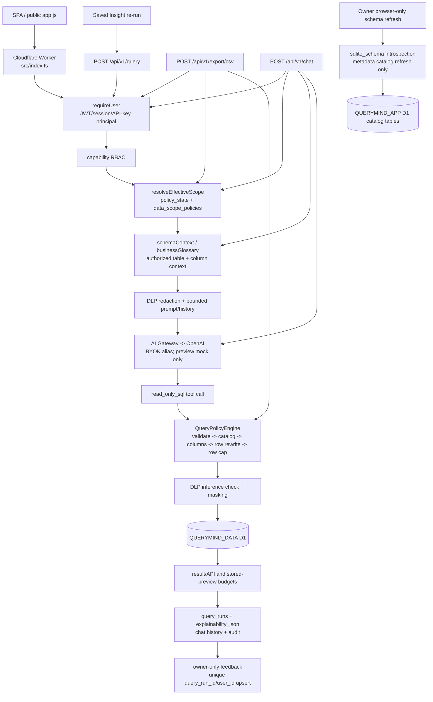

# QueryMind Post-P1 Governed Query Architecture Baseline

**Status:** Frozen as the protected P0/P1 architecture baseline (2026-08-23)

**Scope:** This document records the architecture that is present in the current repository after P0 Governed Query Safety Core and P1 Explainable Query Experience. It is an evidence-backed baseline, not a P2 design and not an authorization to change source code or migrations. The repository implementation is authoritative; older SDD/release prose is historical where it differs from the runtime.

## Current Runtime Architecture

The deployed product runtime is a single Cloudflare Worker with a static SPA and two D1 bindings. `cloudflare/src/index.ts` is the only Worker entry point and routes authenticated product APIs, while `wrangler.jsonc` binds `QUERYMIND_APP`, `QUERYMIND_DATA`, and `ASSETS`. The preview deployment is intentionally `AI_MOCK_MODE=true`; production requires the fail-closed configuration in `runtime-config.ts` and an allowlisted AI Gateway endpoint.

### Request and execution reconstruction

1. `index.ts` applies static runtime configuration to every non-health request, then dispatches `/api/v1/chat`, `/api/v1/query`, CSV export, schema, sessions and product/RBAC routes.
2. `requireUser` establishes an authenticated principal. `requireCapability` applies feature RBAC, and browser-only administration additionally checks the principal type.
3. Business-data requests resolve `EffectiveScope` from the app D1 `policy_state` singleton and active `data_scope_policies`. Missing, stale, malformed, or empty policy state fails closed.
4. Chat resolves scope before calling `schemaContext`, `businessGlossary`, or the model. The context is filtered to scope tables and columns and is bounded before egress.
5. A model tool call is treated as untrusted input. `authorizeQuery` is the only central business-query gate: it validates read-only SQL, extracts sources, checks the catalog and EffectiveScope columns, rewrites deterministic row predicates, and reapplies the bounded SQL validator.
6. The three business D1 execution sites (`routes/agent.ts`, `routes/query.ts`, and `routes/modules.ts` export) execute only `validated.executionSql`. DLP inference checks and result masking happen before response, model tool payload, persistence, or CSV output.
7. Successful governed executions create a `query_runs` row and P1 explainability envelope from deterministic runtime facts. SQL is included only when the principal has `view_schema`. Feedback is a separate owner/run ownership check and idempotent app-D1 upsert.

The only direct `QUERYMIND_DATA` statement outside those governed business executions is `refreshSchemaCatalog` (`lib/schema-catalog.ts:60-90`). It is an authenticated browser-session Owner/`refresh_schema` metadata operation that reads SQLite schema definitions to refresh the app catalog; it is not a business-data query, does not send rows to the model, and never grants authorization. All user/business result paths are governed.

## Protected Architecture Boundaries

### Authentication

`requireUser` is the entry boundary for product APIs. Session, JWT, and API-key principals are represented as authenticated users with capability sets. Production static configuration requires D1, auth secrets, `AUTH_REQUIRED=true`, and no local fallback. Password/session invalidation and rate-limit behavior remain in the P0 security suite.

### Feature RBAC

Capabilities are checked independently of data scope. Examples include `chat`, `export`, `view_schema`, `refresh_schema`, `manage_own_insights`, and owner administration capabilities. A role or capability never substitutes for a data policy. API-key principals cannot acquire browser-only administration.

### EffectiveScope

`resolveEffectiveScope` (`lib/scope.ts:73-117`) verifies `policy_state.expected_migration = '0006'`, loads the user scope key (or role fallback), validates allowed columns and the deliberately narrow row-filter grammar, and computes query/raw/export flags. It is deny-by-default and is resolved before any authorized schema/context is supplied to the model or before business SQL is authorized.

### Authorized Catalog

`schemaContext(env, scope)` (`lib/schema-catalog.ts:93-130`) filters tables, columns, and foreign-key relationships against the resolved scope and enforces a 32,000-character context bound. `businessGlossary` applies the same scope checks to dictionary content. `queryCatalog` is an internal app-D1 catalog used after scope resolution by the policy validator; it is not model context and is never authorization by itself.

### Model Egress Boundary

Prompts, history, dictionary values, and tool result previews are redacted and bounded before provider egress. `gatewayHeaders` sends only the Gateway authorization token and non-secret metadata. OpenAI credentials are expected behind Cloudflare AI Gateway BYOK; they are not browser or repository configuration. Production rejects mock mode, invalid Gateway URL, missing token, and incomplete auth configuration.

### QueryPolicyEngine

`authorizeQuery`/`authorizeReadOnlySql` (`lib/query-policy.ts`) is the mandatory policy boundary. It rejects non-read-only SQL, unknown/unauthorized tables, unauthorized columns and unsafe wildcard projections; limits source complexity; rejects cross/natural joins; rewrites configured row predicates through aliases/joins/CTEs supported by the bounded tokenizer; and enforces the result cap. LLM output cannot bypass or override this function.

### D1 Execution

Business data is executed only against `QUERYMIND_DATA` with `validated.executionSql` in the chat tool path, direct query path, and export path. App-D1 reads/writes for sessions, insights, audit, usage, policy and feedback are product metadata operations, not an alternate business-data executor.

### DLP

`assertNoSensitiveInference` blocks sensitive membership inference through predicates, grouping, ordering, joins, and aggregate conditions. `maskedQueryRows` applies configured and default sensitive-column masking, with conservative whole-result masking when lineage is ambiguous. API responses, model previews, stored previews, and CSV exports retain result byte/row budgets.

### Explainability

`buildQueryExplainability` is called only after successful policy validation, D1 execution, DLP masking, and result construction. The envelope is deterministic (`version: 'p1'`) and derives source tables, applied governance flags, result count/truncation and capability-gated SQL from runtime state; it performs no second model call.

### Feedback

`POST /api/v1/query-runs/:id/feedback` requires authentication, verifies the run belongs to the caller and has `outcome = 'success'`, validates rating/category/comment bounds, and upserts on `(query_run_id, user_id)`. Each upsert is audited without copying free-form comments into audit metadata.

## Mandatory Security Invariants

- Unauthorized tables cannot reach the LLM. Scope-filtered schema/glossary context excludes them, and policy validation rejects them independently of prompt text.
- Unauthorized columns cannot reach the LLM. Catalog/context filtering, policy column checks, wildcard checks, and DLP prevent column leakage.
- Unauthorized table, column, or row SQL cannot execute. Every business execution uses rewritten `validated.executionSql` after `EffectiveScope` and policy checks.
- Chat, direct query, saved-insight re-run, and export use the same policy boundary. Insight create/update validates stored SQL, and the UI re-runs it through `/api/v1/query`; export calls `authorizeQuery` directly.
- Saved SQL never grants permanent authorization. It is revalidated against the caller's current scope on every execution and on insight create/update.
- LLM output cannot override policy. Tool arguments are untrusted input and cannot select a different executor or policy.
- Prompt injection cannot bypass EffectiveScope. Database values and context are marked untrusted, and scope/policy checks occur outside the model.
- Production configuration fails closed. `assertStaticRuntimeConfiguration` rejects missing bindings/secrets, auth fallback, mock AI, and invalid Gateway configuration.
- DLP and result limits remain active. Sensitive inference, masking, maximum rows, 2 MB API payloads, 32 KB stored previews, rate limits, and AI request bounds remain in force.

## P1 Trust Invariants

- Explainability exists only for successful governed executions. Conversational no-tool replies do not invent a query run; failures and rejected SQL do not produce a P1 card.
- Governance facts come from deterministic runtime state: validated referenced tables, resolved row-policy presence, DLP mask results, actual row count/truncation and capability checks.
- SQL visibility remains capability-gated by `view_schema`; otherwise the envelope and history use `redacted`.
- Feedback is owner-only and idempotent. Ownership and successful outcome are checked before the unique-key upsert.
- Explainability never exposes scope keys, raw row predicates, secrets, or credentials. It exposes only labels, high-level governance flags, bounded caveats, and optional authorized SQL.

## Current Database Baseline

The repository contains two forward-only migration streams, verified by directory inspection and disposable initialization:

| Binding | Latest repository migration | Purpose | Verification |
|---|---:|---|---|
| `QUERYMIND_APP` (`migrations/app`) | `0007_explainable_query_experience.sql` | Product/auth/RBAC metadata, schema catalog, policy state and scopes, DLP, query runs, explainability and feedback | `npm run test:db:init` applied app `0001`–`0007` successfully |
| `QUERYMIND_DATA` (`migrations/data`) | `0001_initial_business_schema.sql` | Read-only bundled business SQLite schema and seed data | `npm run test:db:init` applied data `0001` and demo seed successfully |

Migration `0006_governed_query_safety.sql` remains immutable and defines `policy_state.expected_migration = '0006'`; `0007` is additive (`query_runs.explainability_json` and `query_feedback`). The Worker health check requires the policy tables and feedback table and reports the governed policy state. The last recorded Cloudflare release evidence also reports remote app migrations `0005`, `0006`, and `0007` applied, `querymind-data` unchanged, 72 active policy rows and 8 DLP policies. A fresh remote read-only migration query was not possible in this shell because Wrangler required a `CLOUDFLARE_API_TOKEN`; no remote write was attempted during this freeze.

## Known Technical Limitations

1. **Tokenizer/parser boundary.** The policy engine uses a bounded Worker-compatible tokenizer and deterministic extraction, not a maintained SQLite AST parser. Ambiguous or unsupported source shapes fail closed; future SQL features must not weaken that behavior.
2. **D1 execution controls.** Cloudflare D1 does not expose a portable per-statement cancellation/timeout binding in this Worker runtime. The current safety posture therefore relies on AI fetch timeout, SQL complexity limits, source-count limits, row caps, response/stored-preview byte budgets, concurrency/rate controls and fail-closed validation.
3. **Production AI activation.** Preview is healthy with mock AI. Production remains operationally blocked until the operator configures the existing AI Gateway authenticated route, BYOK alias/provider key, token and production variables; this is deployment configuration, not a P2 product capability.
4. **Documentation drift.** Some historical P0/P1 release text still describes the earlier local-only or pre-0007 state. This baseline intentionally follows current code, migration directories, test output and latest recorded deployment evidence.

## Forbidden Future Regressions

P2/P3/P4 work must preserve these rules:

- No direct `QUERYMIND_DATA` business execution outside the central governed execution boundary.
- No full schema, catalog, glossary or relationship exposure before `EffectiveScope`.
- No LLM-based authorization or policy interpretation.
- No independent export authorization implementation.
- No AI-generated row-filter policy.
- No write-enabled AI SQL, PRAGMA, comments, multi-statement execution, or semicolon bypass.
- No treating saved SQL, prompt text, chat history, or database values as permanent authorization or trusted instructions.
- No explainability generated for rejected/failed/ungoverned executions.
- No explainability fields containing scope keys, raw predicates, secrets, credentials or unbounded result data.
- No removal or weakening of DLP inference blocking, masking, row caps, response budgets, rate limits, audit, or production fail-closed gates.
- No migration rewrite of `0006`; policy-version and expected-migration checks must remain explicit.

## Verification

All applicable repository checks were run against the current tree on 2026-08-23:

| Command/check | Exact result |
|---|---|
| `npm run check` | PASS — Wrangler type generation and `tsc --noEmit` |
| `npm run test:unit` | PASS — 66/66; includes 62 P0 security tests/assertions and 4 P1 explainability/feedback tests |
| `node --check cloudflare/public/app.js` | PASS — frontend JavaScript syntax check |
| `npm run test:db:init` | PASS — disposable local D1; data `0001`, app `0001`–`0007`, demo seed |
| `npm run test:e2e` | PASS — 12/12 product/RBAC tests with local Worker, bootstrapped test Owner and refreshed schema catalog |
| `wrangler check startup` | PASS — Worker bundle 151.17 KiB (35.60 KiB gzip); startup analysis completed |
| `npm run deploy:dry-run` | PASS — assets/bindings resolved; 151.17 KiB upload, 35.60 KiB gzip |
| Source-path audit (`rg`) | PASS — three governed business D1 execution sites; schema introspection is the only separate admin metadata path; no alternate business executor found |
| Remote migration read-only check | NOT RUN in this shell — Wrangler required a scoped `CLOUDFLARE_API_TOKEN`; no remote mutation was performed. Last recorded release evidence is preserved above. |

## Freeze Decision

**P0 and P1 are safe to freeze as the protected architecture baseline.** The current source, tests and deployment configuration preserve the required governance and explainability boundaries, and the complete local regression suite is green. The freeze does not claim production AI readiness: the remaining operational blocker is configuration/verification of the authenticated AI Gateway BYOK path and production variables, plus a fresh authenticated remote smoke record.

### Remaining blocker

- Production promotion remains gated until Cloudflare credentials are available for read-only verification and the operator configures `AI_GATEWAY_URL`, `AI_GATEWAY_TOKEN`, `AI_GATEWAY_BYOK_ALIAS`, provider BYOK key, production auth secrets, `ENVIRONMENT=production`, and `AI_MOCK_MODE=false`.

### P2 technical debt (not started)

- Replace the bounded tokenizer with a maintained Worker-compatible SQLite AST/parser after preserving fail-closed tests.
- Define a stronger D1 workload/cancellation strategy or execution isolation if query volume/complexity grows beyond Free-plan budgets.
- Harmonize historical release reports and add a repeatable authenticated remote migration/deployment evidence check.
- Add explicit regression coverage for every newly introduced execution surface before any future P2 semantic capability.

No P2 semantic feature, migration, source-code change, or deployment was started as part of this freeze.
