# QueryMind P2-D — AI Schema Intelligence Draft Suggestions

**Status:** Code and deployment complete on Worker
`31693496-e2b8-4110-92d6-40f61035f182`. P2-D production closeout remains
blocked only on the intentionally manual Owner/DBA AI-generation smoke. P2-D
remains a design-time-only capability.

## Purpose

P2-D helps a Data Owner or DBA discover possible TERM, DIMENSION, METRIC, and
RELATIONSHIP definitions from a deliberately small, authorized structural
schema selection. Its output is an immutable, reviewable **Suggestion**. It is
not semantic truth, a query plan, SQL, an approval, or a runtime context.

```mermaid
flowchart LR
  A[Authenticated browser session] --> B[manage_semantic_drafts]
  B --> C[EffectiveScope]
  C --> D[Authorized structural catalog]
  D --> E[Bounded candidate extraction]
  E --> F[Cloudflare AI Gateway / OpenAI BYOK]
  F --> G[Deterministic P2-D validation]
  G --> H[Immutable OPEN suggestion]
  H --> I[Human edits existing Draft form]
  I --> J[Existing Semantic Repository]
  J --> K[DRAFT revision]
```

The diagram is intentionally not connected to Chat, Direct Query, Saved
Insights, Export, QueryPolicyEngine, or `QUERYMIND_DATA`.

## AI Input Boundary

Before any model request the Worker resolves authentication, feature RBAC,
`EffectiveScope`, and `authorizedSchemaCatalog`. The Gateway receives only the
selected allowed tables, columns, data types, nullability, primary-key facts,
explicit foreign keys, safe labels, deterministic candidates, and the schema
snapshot ID. It receives no data rows, DDL, chat history, result previews,
Saved Insight data, scope keys, row predicates, credentials, bearer values, or
provider secrets.

Metadata is treated as untrusted data. The versioned prompt
`semantic-schema-intelligence-v1` says that names and labels are not
instructions and that output must be a bounded JSON suggestion envelope. Model
egress reuses the existing AI Gateway allowlist, headers, timeout, model
allowlist, rate limits, and credential-redaction controls. Production has no
mock fallback.

## Suggestion and Truth are Separate

Migration `0010_semantic_schema_intelligence_suggestions.sql` adds
`semantic_suggestion_runs` and `semantic_suggestions` to `QUERYMIND_APP` only.
Each run records safe provenance: selected request scope, authorized-catalog,
prompt, and model-configuration fingerprints; model/provider identifiers;
snapshot; bounded status; attempts; and completion outcome. It never stores a
raw prompt, model response, credential, scope key, or row predicate.

Each suggestion has one of `OPEN`, `ACCEPTED`, or `DISMISSED`. The schema
snapshot is stored on its parent run and staleness is derived, never persisted.
The generated type, identity, confidence, suggestion JSON, rationale JSON,
evidence JSON, and fingerprint are protected by a D1 immutability trigger.
`ACCEPTED` means only that an explicitly reviewed Draft was created; it does
not mean Approved or published.

## Candidate and Output Rules

- A request selects at most 8 allowed tables, 120 columns, and 12 suggestions;
  model candidate input is further capped at 20 candidates and the configured
  prompt budget.
- Terms and dimensions use actual selected structural metadata. Secret-like,
  binary, credential, token, and hash-like fields are excluded from heuristic
  selection.
- Metrics use the existing P2-A bounded AST and source validation. They always
  have `defaultFilters: []`; possible business rules appear as assumptions or
  open questions instead.
- Relationships require actual selected explicit FK evidence and deterministic
  one-to-many parent-to-child orientation. No guessed joins are accepted.
- The parser permits only `p2d.v1`, `NEW_ASSET`, exact known fields and P2-A
  contracts. Hallucinated tables, columns, FKs, SQL, invalid ASTs, duplicate
  fingerprints, and output beyond request bounds fail closed and are not
  persisted as OPEN suggestions.

Provider/configuration/security errors do not retry. A transient Gateway or
invalid structured response has at most one retry, for no more than two model
attempts. A failed persisted run contains only a bounded error code and audit
provenance.

## Human-in-the-loop Acceptance

The suggestion workspace is available only to a browser-session principal with
the existing `manage_semantic_drafts` capability. `view_semantics` alone is not
sufficient. List/detail visibility is limited to the requesting user and is
rechecked against the current authorized catalog before output.

Selecting **Use this suggestion to create a Draft** opens the existing P2-C
editor with a prefilled, editable contract. The final request atomically:

1. verifies that the suggestion is OPEN and belongs to the requester;
2. compares its snapshot with the current catalog and recomputes source access;
3. validates every human-edited field through the existing P2-A validation and
   catalog-reference checks;
4. rejects a duplicate type/canonical-name/domain asset;
5. uses the canonical Semantic Repository to create the Asset and revision 1
   as `DRAFT`;
6. changes the suggestion to `ACCEPTED`, stores its Asset/Revision links, and
   writes bounded audit provenance in the same D1 batch.

A conflict leaves no half-accepted suggestion or half-created Draft. Dismissal
is an `OPEN → DISMISSED` transition with a bounded optional reason. Neither
generate, dismiss, accept-as-Draft, nor Draft creation updates
`semantic_registry_state.registry_version`.

## APIs and UI

| Endpoint | Boundary | Purpose |
|---|---|---|
| `GET /api/v1/semantics/suggestions/catalog` | browser + `manage_semantic_drafts` | authorized table picker only |
| `POST /api/v1/semantics/suggestions/generate` | browser + capability | bounded metadata-only generation |
| `GET /api/v1/semantics/suggestions` | browser + capability + requester ownership | paged/filterable history |
| `GET /api/v1/semantics/suggestions/:id` | same | one currently authorized suggestion |
| `POST /api/v1/semantics/suggestions/:id/dismiss` | browser + capability | dismiss an OPEN item |
| `POST /api/v1/semantics/suggestions/:id/accept-as-draft` | browser + capability | human-edited Draft creation |

The Semantic Registry has separate **Semantic Assets** and **AI Suggestions**
workspaces. Suggestion cards show an AI Suggested badge, semantic type,
identity, advisory confidence, definition, structural sources/evidence,
metric AST or FK relationship, assumptions, open questions, snapshot, status,
and only **Use as Draft** / **Dismiss** actions. The SPA escapes all model
prose and never renders model output as executable HTML or raw SQL.

## Protected Runtime Dark State

P2-D does not add a Chat tool, business SQL tool, AI-to-SQL path, or runtime
semantic context. It does not alter EffectiveScope, QueryPolicyEngine, DLP,
P1 explainability/feedback, Save Insight, Export, or the existing authorized
Verified SQL disclosure. Static regression tests assert those runtime modules
do not read `semantic_suggestions`.

AI cannot approve, publish, authorize, run business queries, or modify an
approved revision. P2-E remains the future approval/publication phase; P2-F
remains the future runtime semantic-context phase.

## Verification and Rollback

The local release gate covers the P0/P1 security and explainability tests,
P2-A/B/C tests, P2-D candidate/output/malicious-metadata/dark-state tests,
fresh disposable D1 migrations through 0010, authenticated API/UI workflows,
frontend syntax, diff hygiene, and Worker dry-run. Exact results and production
evidence are recorded in `CLOUDFLARE_D1_OPENAI_REFACTOR_TRACKER.md`.

The pre-P2-D Worker is `5e4ca4b6-8ba1-4259-b2ea-25e6dc9bbfaa`. Should a
runtime regression occur, roll back Worker code to that version but never
reverse the additive forward-only 0010 migration. The tables are dark to
runtime and may stay empty until an Owner/DBA manually runs the bounded
production generation smoke.

## Deployment Evidence — 2026-08-24

- `0010_semantic_schema_intelligence_suggestions.sql` was applied once to
  remote `QUERYMIND_APP`; a follow-up migration list reports no pending
  migrations. `QUERYMIND_DATA`, users, roles, policies, and secrets were not
  changed.
- The final Worker is `31693496-e2b8-4110-92d6-40f61035f182` at
  <https://querymind.digitalaaronl.workers.dev>. It was deployed with the
  existing bindings and secrets retained, plus the exact non-secret production
  variables recovered read-only from the known-good P2-C version.
- A first upload (`2798ee7c-c48e-402b-99ef-fb846cdedb04`) revealed that the
  repository's preview vars overrode same-named production vars even with
  `--keep-vars`. A corrective upload (`b04f82ad-fb35-4cb4-ab37-ce2ab4674c98`)
  restored production mode but exposed a PowerShell comma-parsing issue in the
  model allowlist. Both were immediately superseded before an AI request or
  semantic mutation. The final deployment uses quoted known-good non-secret
  production values: `ENVIRONMENT=production`, `AI_MOCK_MODE=false`, model
  allowlist `gpt-4o,gpt-4o-mini`, the existing authenticated Gateway URL, and
  BYOK alias `production`; secrets were never read or changed.
- Production `/` and `/health` return HTTP 200. Health reports
  `environment=production`, `ai=ready`, both D1 bindings `ok`, and P0 policy
  migration `0006` with 72 policies. Anonymous
  `GET /api/v1/semantics/suggestions` returns 401.
- Post-deploy read-only D1 verification reports schema snapshot
  `9fc08cbf8ee017c5f6041f7eaa6b7a0b0411b185f4d7e503e0ca47ecdc3b49d3`,
  `registry_version=0`, zero Assets/Revisions/Reviews, and zero suggestion runs
  in every lifecycle state (`rows_written=0`, `changed_db=false`).
- Local gates: `npm run check` PASS; `npm run test:unit` 94/94 PASS;
  `npm run test:e2e` 19/19 PASS; fresh `npm run test:db:init` through app
  0010/data 0001 PASS; `npm run test:all` 113/113 PASS; `node --check
  public/app.js` PASS; `git diff --check` PASS (line-ending warnings only);
  Worker dry-run PASS at 292.54 KiB / gzip 63.58 KiB.

No production AI generation or accept-as-Draft operation was automated. An
Owner/DBA should later choose `products`, TERM and DIMENSION, and a maximum of
three suggestions; confirm that only OPEN suggestions appear, then stop. Do
not choose Use as Draft for this smoke. The existing authorized P1 chat query
(`請依商品列出銷售額`) must also be manually run to confirm its sales-amount,
product-dimension, and authorized non-empty Verified SQL behavior is unchanged.
