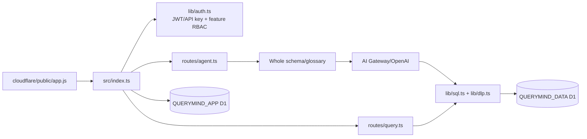
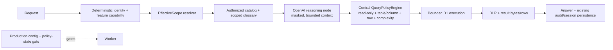

# P0 Governed Query Safety Core — Software Design Description

**Status:** Local implementation and verification complete; remote promotion blocked pending Cloudflare authentication.  
**Runtime:** Cloudflare Worker + D1 + `cloudflare/public` SPA + AI Gateway/OpenAI  
**Scope:** P0 authorization, authorized context, deterministic query policy and production safety gate. SSO, multi-provider, RAG, ETL, writes and control-plane work remain out of scope.

## Context

The Worker currently authenticates users and checks feature capabilities, but it sends the complete schema catalog to the model and accepts any lexical `SELECT`/`WITH` that passes the existing guard. DLP masking is defense-in-depth, not table/column/row authorization. The P0 milestone adds a narrow, deny-by-default data scope while preserving the existing single-D1 and OpenAI Gateway seams.

## Current Architecture



## Target P0 Architecture



## Data Model

Forward-only app migration `0006_governed_query_safety.sql` adds:

- `users.data_scope_key`: optional explicit scope assignment; blank values resolve to `role:<role_name>` for backward compatibility.
- `data_scope_policies`: one active row per `(scope_key, table_name)` containing an explicit JSON column allowlist, a validated deterministic row predicate, raw/export flags and update metadata. Missing tables are denied.
- `policy_state`: singleton release state containing the expected policy migration identifier and policy version. Health is unhealthy when this state or active policy rows are missing.

Migration `0006` seeds explicit policies for every currently known business table under each existing role scope. Future schema refreshes only update the catalog; they do not create policy rows. A migration also contains `scope:tw` and `scope:jp` fixtures for deterministic row-policy regression tests, but no existing user is assigned to them.

## EffectiveScope Contract

```ts
type RowPolicy = {
  tableName: string;
  predicate: string;
};

type EffectiveScope = {
  userId: string;
  roleId: string;
  roleName: string;
  scopeKey: string;
  policyVersion: string;
  capabilities: string[];
  datasource: {
    id: "querymind-data";
    tables: Record<string, {
      columns: string[] | "*";
      rowFilter?: RowPolicy;
    }>;
  };
  canQuery: boolean;
  canViewRawData: boolean;
  canExport: boolean;
  canBulkExport: boolean;
};
```

The resolver is server-side and runs before schema/glossary retrieval and every business D1 execution. It rejects a missing policy state, malformed JSON, unknown policy table, unsafe row predicate or empty effective policy.

## Policy Evaluation Flow

- **Chat:** authenticate → resolve scope → load only authorized catalog/glossary → call Gateway → run `QueryPolicyEngine` → D1 → DLP/result budget → persist.
- **Direct query:** authenticate → resolve scope → policy engine → D1 → DLP/result budget → persist.
- **Saved insight:** validate against current scope at create/update and revalidate again when executing; a previously saved SQL never grants access.
- **CSV/export:** require feature export and scope export permission, then use the same policy engine and DLP before streaming.
- **Schema view:** resolve scope and return only authorized table/column/FK metadata. Refresh remains an owner/capability action and never auto-authorizes new tables.

## SQL Safety Flow

The existing lexical boundary remains as a first-pass compatibility guard. `QueryPolicyEngine` then tokenizes the supported SQLite subset, collects physical table references and aliases, rejects unknown/unapproved tables and disallowed columns, rejects wildcard joins when the scope is not complete, rejects cross joins/obvious excessive complexity, validates stored row predicates, rewrites each referenced row-policy table as a filtered derived table (including nested/CTE/join occurrences), and applies the existing outer row limit.

No maintained, Worker-compatible SQLite AST parser is present in the repository and adding a heavyweight SQL engine would materially enlarge the Free-plan Worker. The tokenizer/rewrite is therefore deliberately conservative: ambiguous structures fail closed and the SDD documents this limitation. It is not presented as a general SQL parser.

Cloudflare D1 does not expose a portable per-statement cancellation/timeout binding in this runtime. The implementation preserves AI fetch timeout and adds deterministic result/complexity/concurrency guards; the limitation is exposed in the release report rather than simulated with a fake timeout.

## Model Egress Boundary

User prompt and stored history are redacted for obvious credential/token patterns before model use and persistence. Schema and glossary content are wrapped as data, are scoped before construction, and are not instructions. Database rows sent to the second model turn are already DLP-masked and bounded. The policy engine—not the prompt—remains authoritative for authorization, row filters and operation limits.

## Migration Strategy

Apply `0006` forward-only after inspecting remote state. No destructive or automatic repair is allowed. Local disposable D1 applies `0001`–`0006`, including the previously excluded `0005` DLP policy. Health checks require `policy_state.expected_migration = '0006'` and active policy rows. If remote auth is unavailable, deployment and remote migration remain blocked and must not be guessed.

## Backward Compatibility

Existing role names, capability checks, chat/direct/export endpoints, DLP, sessions and result budgets remain. Existing users with blank `data_scope_key` resolve to their role scope. Existing saved SQL is not trusted; it is revalidated against the current policy at execution. The legacy FastAPI/Nuxt/AWS code is not modified by this P0.

## Security Threats

| Threat | Deterministic P0 control |
|---|---|
| Direct prompt injection | LLM cannot grant scope; every SQL path re-evaluates policy. |
| Indirect injection from database/glossary content | Content is data-delimited, scoped, masked/bounded; policy is outside the model. |
| Unauthorized table | Authorized catalog excludes it and policy engine rejects it. |
| Unauthorized column | Catalog excludes it; explicit/qualified/wildcard references are rejected. |
| Row-scope bypass | Policy predicate is rewritten at every physical table reference, including nested/CTE/join forms; ambiguous forms fail closed. |
| SQL mutation/multiple statements | Existing lexical guard remains and policy engine requires SELECT/WITH. |
| Schema leakage | Schema endpoint and model context use EffectiveScope. |
| Export leakage | Export requires capability plus scope and reuses the central engine/DLP. |
| Missing migration/policy | Health and production runtime gate fail closed. |
| Auth fail-open | Non-local/production configuration rejects `AUTH_REQUIRED != true`. |

## Test Plan

Add unit coverage for explicit/qualified/wildcard columns, unauthorized tables, row-policy aliases/subqueries/CTEs/joins/aggregations, prompt injection, DML/DDL regressions and production config. Extend local D1 initialization to include `0005`/`0006`; run existing security, RBAC and product E2E tests. Keep legacy code tests unchanged.

## Rollback Plan

Before any remote deployment, record the last known-good Worker version. If Worker behavior regresses, use the existing `wrangler rollback <VERSION_ID>` runbook. Do not roll back or rewrite D1 automatically. A migration incompatibility requires stopping traffic or reverting Worker code while preserving the additive schema.

## Deployment Plan

1. Run type generation/typecheck, unit/security tests, local D1 setup, E2E and deploy dry-run.
2. Verify Wrangler account, Worker and both D1 IDs; inspect remote migration list read-only.
3. Apply only pending `0006` remotely after confirmation of target IDs.
4. Deploy Worker with existing `cloudflare/wrangler.jsonc` and record version/commit.
5. Run health, auth, authorized query, unauthorized table/column/row, direct query, export, schema and logging smoke tests.

## Acceptance Criteria

- EffectiveScope is deterministic and computed before all retrieval/execution paths.
- Unauthorized tables/columns are absent from model/schema context and denied if manually submitted.
- Configured row restrictions survive aliases, nested queries, CTE, joins and aggregation; ambiguous SQL fails closed.
- Chat, direct query, saved insights and export use one central policy boundary.
- Existing read-only/DLP/rate/result controls remain green.
- Production rejects insecure auth/mock/Gateway/policy state.
- Only scoped, redacted, bounded context reaches OpenAI.
- Local regression suite proves authorization and prompt-injection invariants.
- Remote Worker is deployed and smoke-tested, or release is explicitly blocked by unavailable Cloudflare credentials without claiming completion.
