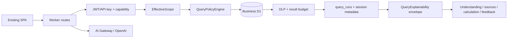

# QueryMind P1 — Explainable Query Experience

**Status:** Local implementation complete; remote promotion pending valid Cloudflare authentication  
**Runtime:** Cloudflare Worker + D1 (`QUERYMIND_APP`, `QUERYMIND_DATA`) + existing SPA + AI Gateway/OpenAI  
**Compatibility:** P0 Governed Query Safety Core remains the authorization boundary. Legacy FastAPI/Nuxt/Postgres/AWS code is out of scope.

## Current architecture

The SPA calls the Worker through the existing `/api/v1/chat` and `/api/v1/query` routes. Authentication and product capability checks run in `lib/auth.ts`; `EffectiveScope` is resolved by `lib/scope.ts`; `QueryPolicyEngine` validates the read-only SQL, authorized tables/columns and row-policy rewrite; DLP masks results before persistence or model context. The agent performs the existing two-turn OpenAI-compatible tool loop and stores bounded previews in `chat_messages`. D1 application metadata and business data remain separate bindings.



## P1 target flow

1. Authenticate and resolve the same P0 scope used for execution.
2. Run the validated query through the existing policy, DLP and result-budget path.
3. Generate a bounded deterministic `QueryExplainability` envelope from the user prompt, validated SQL, physical table references, effective scope metadata, masked-column list and result budget. No second explanatory model call is required.
4. Persist the envelope in `query_runs.explainability_json` and in the bounded assistant message metadata. Raw SQL is included only when the caller has `view_schema`; row predicates, scope keys, credentials and failed SQL are never included.
5. Render the envelope in the existing SPA as Query Understanding, Data Sources / Governance, How calculated, optional SQL disclosure, Result Summary and feedback controls.
6. Accept feedback only for an authenticated owner of a successful `query_run`; upsert on `(query_run_id, user_id)` and write an audit event.

## Explainability contract

```ts
interface QueryExplainability {
  version: "p1";
  queryRunId: string;
  understanding: {
    intent: string;
    metrics: string[];
    dimensions: string[];
    filters: string[];
    timeRange: string | null;
    ranking: string | null;
    assumptions: string[];
    confidence: "high" | "medium" | "low";
  };
  sources: {
    tables: Array<{ name: string; label: string }>;
    governance: { scopeApplied: boolean; rowPolicyApplied: boolean; columnPolicyApplied: boolean; dlpApplied: boolean };
    result: { rowCount: number; truncated: boolean };
  };
  explanation: { business: string; rawSqlAvailable: boolean; sql?: string };
  summary: { headline: string; highlights: string[]; caveats: string[] };
  feedback: { supported: true; queryRunId: string };
}
```

The source tables and governance flags are server-derived from `referencedTables`, `EffectiveScope`, DLP and the actual result. Prompt/SQL heuristics only describe intent and grouping; they cannot grant access or override security facts. The envelope deliberately exposes that a row policy was applied without exposing its predicate or the user's `scopeKey`.

## Persistence and API

Forward-only migration `cloudflare/migrations/app/0007_explainable_query_experience.sql` adds `query_runs.explainability_json` and the additive `query_feedback` table with category validation, comments bounded to 800 characters, indexes and a unique `(query_run_id, user_id)` constraint. `query_runs` remains the source of truth for executed SQL and ownership; the envelope is a bounded presentation/audit record, not a duplicate result store.

`POST /api/v1/query` now returns `queryRunId` and `explainability` for successful executions, while retaining rows, row count, masking and duration fields. `POST /api/v1/chat` returns the same envelope for the governed tool-call turn and persists it in session metadata. `POST /api/v1/query-runs/:id/feedback` validates rating/category/comment, checks successful-run ownership, performs an idempotent upsert and emits `query.feedback.upserted` without persisting the comment in audit metadata.

## Frontend behavior

The existing `cloudflare/public/app.js` and `styles.css` receive a compact result flow: answer, Query Understanding, Data Sources / Governance, How calculated, bounded result summary, optional capability-gated SQL disclosure and feedback. All dynamic explainability values are escaped. The UI does not render scope keys or raw row predicates. Negative feedback asks for a bounded category and optional comment; positive/negative repeat submissions update the same row.

## Security and cost boundaries

- P0 authorization, row-policy rewriting, DLP inference checks, result byte/row caps, rate limits and prompt redaction execute before explainability is built.
- Explainability is produced after successful governed execution, so rejected or failed SQL is not shown as a result explanation.
- Raw SQL is returned/rendered only under the existing `view_schema` capability; persisted history uses a redacted marker when a caller is not authorized.
- No extra model call is made. Any AI answer remains presentation text; deterministic governance fields come from Worker state.
- Feedback is authenticated, owner-only, successful-run-only and idempotent.

## Verification plan and rollback

Run type generation/typecheck, the existing P0 security suite, P1 explainability/feedback tests, disposable D1 migrations through 0007, local Worker route smoke, and desktop/mobile SPA smoke. Do not edit or rerun migration 0006. Remote migration/deploy is a separate operator action after inspecting remote state and confirming a valid Wrangler token. If promotion regresses, use the existing Worker-version rollback runbook; do not roll back D1 or delete feedback data automatically.
