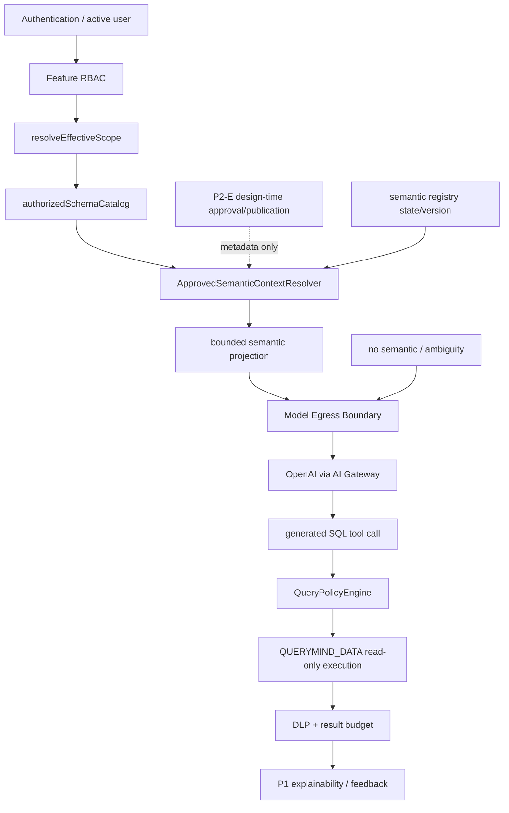

# QueryMind P2-F — Approved Runtime Semantic Context

**Status:** implementation complete and release-quality green; deployment remains gated by P2-E authenticated closeout. P2-F adds no migration and performs no production Semantic mutation.

**Baseline:** P0 Governed Query Safety Core, P1 Explainable Query Experience, P1.2 Feedback & Trust, and P2-A through P2-E. The current Worker remains the source of truth: authentication and feature RBAC precede `resolveEffectiveScope`; authorized schema/catalog retrieval is scope-filtered; Chat/Direct Query still use the P0 `QueryPolicyEngine`; P2-E is design-time governance only.

## 1. Scope

P2-F adds one deterministic, read-only resolver that projects currently approved
and runtime-eligible Semantic Registry revisions into bounded model context. The
resolver is a consumer of `EffectiveScope` and the authorized catalog. It may
describe business meaning, but it never grants data access, executes SQL, or
changes semantic lifecycle state.

The first implementation must support TERM, DIMENSION, METRIC, and RELATIONSHIP
assets, exact revision/dependency pins, domain variants, aliases, grain,
relationship keys, and the registry epoch. The projection is request-scoped and
must be safe to omit when no unambiguous authorized semantic is available.

## 2. Non-goals

- No new D1 migration or schema rewrite.
- No semantic authoring, review, approval, publication, suspension, or resume API.
- No AI-generated semantic approval or authorization decision.
- No direct `QUERYMIND_DATA` read and no write-enabled AI SQL.
- No replacement of `QueryPolicyEngine`, DLP, result budgets, P1 explainability,
  or P1.2 feedback.
- No full registry dump, raw SQL formula injection, reviewer/audit exposure, or
  automatic cross-domain guessing.
- No cache implementation in the first P2-F slice; only the version contract is
  specified here.

## 3. Architecture position



The resolver is inserted after EffectiveScope and authorized catalog retrieval,
before model egress. `QueryPolicyEngine` remains the final authority for every
SQL path. P2-F must be disabled without changing the current P1 path: the model
may continue with the existing authorized physical catalog, or the request may
ASK/REFUSE according to the failure contract below.

## 4. Resolver contract

Implement a pure-orchestration component such as:

```ts
type ApprovedSemanticContextResolver = {
  resolve(input: {
    database: D1Database;
    scope: EffectiveScope;
    catalog: AuthorizedSchemaCatalog;
    requestedDomain?: string;
    prompt: string;
    now: string;
  }): Promise<ResolvedSemanticContext>;
};
```

The resolver must read the current registry epoch, join each asset to its exact
`current_approved_revision_id`, and verify runtime eligibility and all physical
and semantic dependencies. It returns a bounded result, an explicit omission or
ASK reason, and the epoch/snapshot used. It must not return raw rows, secrets,
scope keys, row predicates, approval comments, reviewer identities, incident
details, or credentials.

The resolved projection carries only:

- asset ID, semantic type, canonical/display name, selected domain, and revision ID;
- bounded definition/description and aliases;
- bounded metric AST (not SQL text), dimensions, unit, and grain;
- authorized physical source table/column mappings;
- exact dependency asset/revision IDs that were independently resolved;
- relationship endpoints, key mappings, and cardinality; and
- registry version plus schema snapshot ID as internal provenance.

The public model context may omit internal IDs if the model does not need them,
but the Worker must retain them in request-local state for future P2-G evidence.

## 5. Authorization sequence

The mandatory order is:

```text
Authentication
  -> Feature capability (`chat`)
  -> resolveEffectiveScope
  -> authorizedSchemaCatalog(scope)
  -> read registry epoch
  -> select APPROVED/current/runtime-eligible ACTIVE revisions
  -> validate domain and all physical/dependency sources against scope + catalog
  -> resolve ambiguity
  -> emit bounded projection
  -> Model Egress Boundary
```

No implementation may query all semantic payloads and filter them after model
context assembly. SQL parameters and predicates must remain deterministic and
bounded. A semantic source that is not represented in the authorized catalog is
not authorized merely because the registry record exists.

## 6. EffectiveScope handling

`resolveEffectiveScope` is the only source of user data authorization. It must
run before any semantic payload/source retrieval that could reach the model.
The resolver consumes, but never mutates or extends, these fields:

- `scopeKey`, role/capabilities, and `policyVersion`;
- allowed table/column sets in `scope.datasource.tables`;
- row-policy presence (used as a reason to avoid claiming unrestricted meaning);
- `canQuery`, raw-data, export, and bulk-export flags; and
- the authorized data source identity.

A semantic definition referencing an unauthorized table or column is excluded
or causes the explicit fail-closed outcome. A semantic record cannot add a table,
column, row predicate, export permission, or capability to EffectiveScope.

## 7. Approved/current/runtime-eligible filter

The resolver must enforce all of the following before projection:

```text
semantic_assets.asset_status = 'ACTIVE'
AND semantic_revisions.revision_status = 'APPROVED'
AND semantic_revisions.revision_id = semantic_assets.current_approved_revision_id
AND semantic_publications.revision_id = semantic_revisions.revision_id
AND semantic_publications.runtime_eligibility = 'ELIGIBLE'
AND semantic_publications.registry_version_after = current registry version
AND revision.schema_snapshot_id = current schema snapshot
```

The publication join is mandatory; an `APPROVED` row without a current,
eligible publication is not runtime truth. Exclude DRAFT, IN_REVIEW, REJECTED,
superseded, deprecated, emergency records still pending post-review, suspended,
stale, AI-suggestion, and orphaned revisions. P2-D `semantic_suggestions` are
never runtime semantic context.

## 8. Authorized Catalog integration

Use the already scope-filtered `AuthorizedSchemaCatalog` as the physical source
allowlist. For each source in a candidate revision:

1. normalize table/column names using the same identifier rules as P0;
2. require the table to exist in `scope.datasource.tables` and the catalog;
3. require every referenced column to be allowed by that table policy;
4. require relationship keys to be present and authorized on both endpoints; and
5. require the candidate snapshot to equal the catalog snapshot used in this request.

Do not call the legacy unscoped `schemaContext` for P2-F. Do not expose row
predicates or DDL to the model. A row-scoped table may still be semantically
described, but the model must not be told that the semantic bypasses the runtime
row policy; all generated SQL remains subject to P0 policy rewriting/validation.

## 9. Dependency handling

`semantic_sources` with `source_kind = SEMANTIC_DEPENDENCY` must point to the
exact `(asset_id, revision_id)` pair. Resolve dependencies recursively with:

- a maximum depth and total asset count bounded by Worker limits;
- a visited set to reject cycles;
- the same ACTIVE/current/APPROVED/ELIGIBLE/snapshot checks at every level;
- independent EffectiveScope/catalog authorization for every physical source; and
- deterministic ordering by semantic type, canonical name, domain, and revision ID.

If a dependency is missing, stale, unauthorized, suspended, or ambiguous, the
parent is excluded (or the request enters ASK when the user can choose a valid
variant). Never substitute the latest revision or a dependency with a matching
name.

## 10. Cross-domain ambiguity (Q97)

Support **Enterprise Canonical + Domain-approved Variants**. Domain is a
selection dimension, not an implicit user-department authorization rule.

- One authorized candidate for the requested intent/domain: select it.
- Multiple authorized candidates with materially different definitions: return
  `ASK` with bounded candidate labels/domains; never guess.
- No candidate, or only unauthorized candidates: omit semantics and continue the
  existing P1 path, or `REFUSE` when the user explicitly demands a governed
  semantic unavailable to the scope.
- A global canonical candidate may be selected only when its source/dependencies
  are authorized and it is not contradicted by a more specific requested domain.

The internal ambiguity contract should be future-compatible with P3:

```json
{
  "status": "ASK",
  "code": "SEMANTIC_DOMAIN_AMBIGUOUS",
  "candidates": [{"assetId":"…","revisionId":"…","domain":"…","label":"…"}],
  "registryVersion": 0
}
```

Candidate lists are bounded and contain no formulas, raw source data, or hidden
authorization details.

## 11. Bounded model context

Build a structured section with deterministic limits rather than dumping the
registry:

```text
<approved_semantics registry_version="…" schema_snapshot_id="…">
Metric: <canonical/display name>, domain=<domain>, revision=<id>
  definition=<bounded text>
  expression_ast=<bounded JSON AST>
  grain=<bounded grain>
  sources=<authorized table.column mappings>
Dimension: ...
Relationship: endpoint/key/cardinality only
</approved_semantics>
```

Only allowlisted fields are serialized. Enforce per-asset and total character/
asset/dependency limits; deterministic truncation is preferable to silently
including a second unbounded query. Do not serialize raw SQL formulas, approval
comments, audit metadata, emergency incident fields, reviewer names, row
predicates, credentials, or unapproved payload fields. Semantic text is untrusted
input and must be delimited/escaped so instructions cannot alter policy behavior.

## 12. Registry version and cache contract

The first P2-F implementation need not cache. If a request-local or later
persistent cache is introduced, its key/invalidation dimensions must include at
least:

```text
registry_version
schema_snapshot_id
EffectiveScope identity + scope key
role/capability context relevant to semantic visibility
requested domain / normalized intent class
resolver contract version
```

Any registry epoch change, schema refresh, scope/policy change, authority/runtime
suspension, or publication state change invalidates affected context. A version
change observed between resolver read and model egress must discard the context
or restart resolution; it must never send stale semantics.

## 13. Failure modes

| Condition | Required result |
|---|---|
| Policy state/scope unavailable | Existing fail-closed P0 error; no semantic retrieval |
| Catalog missing/stale | Omit semantic context or return existing catalog error; never use stale source mapping |
| Unauthorized physical source/dependency | Exclude candidate; if explicitly required, `REFUSE` |
| Missing/inconsistent current pointer/publication | Exclude candidate and emit non-sensitive diagnostic |
| Runtime suspended / emergency post-review pending | Exclude candidate |
| Cross-domain ambiguity | `ASK`, bounded candidate list, never guess |
| Registry epoch drift | Discard/re-resolve; if unresolved, continue P1 without semantic context |
| Payload/AST/dependency limits exceeded | Exclude candidate and record bounded reason |
| Semantic text contains instruction-like content | Treat as data; model cannot alter authorization or tool contract |

Continuing with the existing non-semantic P1 path is allowed only when the user
did not explicitly require a named semantic. It must not be implemented as an
unauthorized fallback to a rejected or stale semantic.

## 14. APIs and internal components

P2-F should initially expose no new public mutation API. Recommended internal
components:

- `approved-semantic-context.ts`: resolver orchestration and bounded projection;
- `semantic-runtime-repository.ts`: parameterized current/publication/dependency
  reads from `QUERYMIND_APP`;
- `semantic-context-contract.ts`: schemas, limits, ambiguity/failure codes;
- `semantic-context-authorization.ts`: physical source checks against
  `EffectiveScope` and `AuthorizedSchemaCatalog`; and
- an explicit call site in the existing Chat preparation path after scope/catalog
  resolution and before `gatewayCompletion`.

Direct Query, saved insight, export, and schema endpoints must not independently
interpret semantic metadata. If a later product surface needs semantics, it must
call the same resolver and still use the central QueryPolicyEngine for SQL.

## 15. Observability

Record non-sensitive, bounded telemetry only:

- resolver contract/version, registry version, schema snapshot ID;
- candidate count, selected/omitted/ASK/REFUSE outcome and bounded reason code;
- authorized source/dependency counts (not raw predicates or business rows);
- context size/asset count and resolver duration;
- correlation/query-run ID for later P2-G evidence; and
- policy/catalog/runtime drift counters.

Never log semantic payload text wholesale, raw SQL, credentials, scope keys,
reviewer identities, incident references, or business rows. Logs must not imply
that selection equals authorization.

## 16. Security tests

Required unit/API tests include:

- unauthorized table/column semantic never reaches model context;
- semantic metadata never expands EffectiveScope or export/raw permissions;
- source policy wins over a permissive semantic definition;
- DRAFT, IN_REVIEW, REJECTED, superseded, deprecated, suspended, stale, and
  suggestion records are excluded;
- only the current exact Approved revision and eligible publication are included;
- missing, unauthorized, cyclic, or stale dependencies fail closed;
- cross-domain ambiguity produces ASK rather than a guess;
- semantic text cannot add tool calls, bypass instructions, or policy changes;
- registry/schema/scope version drift invalidates request-local context; and
- no semantic path can write QUERYMIND_DATA or approve/publish revisions.

## 17. Integration and regression tests

Use disposable APP/DATA D1 with deterministic fixtures and preserve all existing
P0/P1/P1.2/P2-A/B/C/D/E suites. Add integration coverage for:

- Chat with one authorized Metric + Dimension and exact source projection;
- Chat with no matching semantic, proving the existing P1 query still works;
- authorized row-scoped data where SQL still passes QueryPolicyEngine and DLP;
- two legal domain variants and the ASK contract;
- dependency revision pin changes, schema refresh, registry epoch changes, and
  runtime suspension;
- SQL, CSV, saved insight, and Direct Query paths remaining governed; and
- explainability retaining P1 behavior, with semantic IDs held internally only
  until P2-G.

Every test must assert model-bound context separately from executed SQL and must
prove that semantic authorization is not data authorization.

## 18. Rollout plan

1. Add resolver and contract tests behind a disabled feature flag/config gate.
2. Run disposable D1, typecheck, source-path audit, security suite, full product
   E2E, Worker startup/dry-run, and clean-clone CI.
3. Shadow-resolve for authorized operator sessions without sending the projection
   to the model; compare selected/omitted outcomes and latency.
4. Enable bounded context for an internal allowlist while retaining a kill switch
   to the current P1 path; monitor refusal/ASK, drift, context size, and policy
   denials.
5. Expand only after review of non-sensitive evidence and authenticated regression
   smoke. No production semantic assets may be created by rollout automation.
6. Keep Worker rollback separate from forward-only D1 migrations; a rollback must
   disable semantic context without weakening P0/P1 or deleting registry history.

## 19. P2-G boundary

P2-F must retain enough request-local identifiers for a later P2-G explainability
extension: semantic asset ID, exact revision ID, selected domain, semantic type,
registry version, and schema snapshot. P2-F must not rewrite the P1 envelope,
expose semantic evidence to users, or change feedback semantics. P2-G owns the
successful-governed-run evidence contract and its capability/privacy review.

## Forbidden regressions

No full semantic registry before EffectiveScope; no LLM-based authorization; no
semantic source granting table/column/row access; no direct `QUERYMIND_DATA`
execution outside `QueryPolicyEngine`; no AI approval/quorum; no raw SQL formula
or governance/audit leakage into model context; no independent export policy;
no write-enabled AI SQL; no silent cross-domain guessing; and no P2-F code in a
P2-E closeout or readiness-only release.
