# QueryMind P2-G — Semantic Evidence Hook

## 1. Objective

P2-G adds bounded, immutable provenance showing which approved Semantic
revision the P2-F runtime actually supplied to a successful governed Chat
execution. It is an explainability extension, not an authorization mechanism.

## 2. Non-goals

There is no semantic learning, feedback-to-registry mutation, correctness
scoring, re-evaluation, lineage graph, new search, planner, write SQL, or
production Semantic activation. Direct Query remains non-semantic.

## 3. Architecture position

```mermaid
flowchart LR
  A[Authentication + feature RBAC] --> S[EffectiveScope]
  S --> C[Authorized Schema Catalog]
  C --> R[P2-F ApprovedSemanticContextResolver]
  R -->|exact selected revisions| M[OpenAI / AI Gateway model context]
  M --> Q[QueryPolicyEngine]
  Q --> D[D1 read-only execution]
  D --> L[DLP masking + result budget]
  L --> E[P1 QueryExplainability]
  R -. same handoff provenance .-> E
  E --> P[(query_runs.explainability_json)]
  E --> U[Explainability UI / API]
  U --> F[P1.2 owner feedback]
  F -. candidate evidence only .-> X[No Registry mutation]
```



The resolver is called after EffectiveScope and Authorized Catalog are
resolved. The selected projection travels in memory with the request and is
passed to explainability only after SQL authorization, execution, masking and
result-budget checks succeed. No post-run Registry read exists.

## 4. P2-F provenance handoff

`SelectedSemanticProvenance` is the resolver's exact selection snapshot:
asset ID, revision ID, type, canonical/display identity, domain, catalog- and
scope-filtered physical source mappings, schema snapshot, and bounded
type-specific display facts. It is derived from the same candidate that was
serialized to the model. Dependency candidates and unauthorized candidates are
not reintroduced. P2-G does not inspect the Registry.

## 5. Semantic Evidence contract

The additive `QueryExplainability.semanticEvidence` object is:

```ts
{
  mode: "USED" | "NOT_USED",
  registryVersion: number | null,
  schemaSnapshotId: string | null,
  selections: Array<{
    assetId: string,
    revisionId: string,
    semanticType: "TERM" | "DIMENSION" | "METRIC" | "RELATIONSHIP",
    canonicalName: string,
    label: string,
    domain: string,
    grain?: string,
    metricAstSummary?: string,
    sources: Array<{ table: string, column?: string }>,
    relationshipRefs?: string[],
    definition?: string
  }>
}
```

`metricAstSummary` is a deterministic bounded rendering of the validated AST,
never Registry SQL. Source mappings are already authorized by P2-F. TERM
definition is capped display text; no aliases, approval history, policy, or
arbitrary payload is persisted.

## 6. USED / NOT_USED / historical compatibility

`USED` is emitted only when the P2-F resolver returned `READY` with one or more
selected definitions and the governed query completed successfully. The exact
resolver registry epoch and schema snapshot are copied.

`NOT_USED` has an empty selection list and null registry/snapshot. It is emitted
for feature-off, empty/no-match/fallback/ambiguity paths, and Direct Query. An
ASK response has no successful governed QueryRun and never selects a candidate.

QueryRuns written before P2-G have no `semanticEvidence`; the UI displays a
small “historical query has no semantic evidence recorded” state. It does not
turn missing history into `NOT_USED` and does not backfill.

## 7. Immutable snapshot rules

Evidence is part of the immutable `query_runs.explainability_json` envelope.
Successful Chat and Direct Query inserts are performed in the existing D1
batch with the chat/audit records. Registry publication, suspension, or a new
revision cannot update old QueryRuns. Feedback remains owner-only,
idempotent, and cannot mutate the Registry.

## 8. Registry version and schema snapshot

For `USED`, `registryVersion` and `schemaSnapshotId` are the values observed by
P2-F before its final drift check. They are not fetched after execution. For
`NOT_USED`, null values avoid implying that a semantic was consumed.

## 9. Source authorization

P2-G only serializes `SelectedSemanticProvenance.sources`; it performs no weaker
authorization. P2-F has already checked EffectiveScope and Authorized Catalog.
Scope keys, predicates, filtered sources, secrets, credentials, and row values
are prohibited.

## 10. QueryRun persistence

No migration is required. P1 migration 0007 already provides bounded,
JSON-valid `query_runs.explainability_json`. The existing `persistSuccess` and
`recordQueryRun` batch paths persist the additive envelope. Evidence
serialization is bounded; an unexpected serialization error fails the run
instead of storing a fabricated or partial claim.

## 11. API

Chat and Direct Query response envelopes expose the same additive field as the
stored QueryExplainability. Existing P1 clients may ignore it. Existing detail
and feedback routes continue parsing the P1 envelope; no new endpoint or
feedback target is introduced.

## 12. Frontend

The existing explainability panel adds a compact “使用的企業語意” section.
USED shows business label/type/domain, revision, bounded grain/calculation and
authorized sources, with expandable technical IDs and epoch/snapshot. NOT_USED
is a low-noise trust statement. Missing historical evidence is explicitly
distinct. Every dynamic value is escaped as text; no raw HTML or executable
semantic content is rendered.

## 13. Failure behavior

Evidence construction is synchronous with the successful result envelope. If
its bounded serialization fails, the run follows the existing error path and
does not claim success with incomplete evidence. D1 batch failure likewise
prevents a successful QueryRun response from being returned.

## 14. Bounds

At most 8 selected semantics, 8 physical sources per selection, 4 relationship
references, 500 characters of AST summary, 280 characters of TERM definition,
and 8,000 encoded bytes of evidence are allowed. P2-F remains bounded at 8
assets, 12,000 model-context bytes, and 128 candidate scan rows.

## 15. Security

`Semantic Evidence is observational, not authoritative.` It cannot influence
EffectiveScope, the Authorized Catalog, QueryPolicyEngine, SQL rewrite, DLP,
result budgets, or model input. The model remains outside the security
boundary. Unauthorized Semantic metadata cannot enter the resolver selection,
model context, evidence, API, or UI.

## 16. Tests

P2-G tests cover exact selection identity, registry/version immutability (R1 →
R2), NOT_USED feature-off/Direct Query behavior, unauthorized/scope-internal
redaction, preserved P1 fields and P1.2 feedback compatibility. Existing P0,
P1/P1.2, P2-A–F, E2E, D1 and release gates remain required.

## 17. Rollout

Deploy additively with `SEMANTIC_RUNTIME_CONTEXT_ENABLED=false`; current empty
Production therefore safely records NOT_USED for new governed runs. USED is
proven in disposable/integration tests only. No production Semantic assets are
created or activated.

## 18. Rollback

Because no migration is added, rollback is Worker-only to the immediately
previous P2-F version. Existing historical P1 envelopes remain readable by the
old Worker.

## 19. Next-phase boundary

P2-G ends at deterministic evidence output. It does not activate runtime
Semantics in Production or begin P3 structured intent, planner, evaluation, or
learning work.
