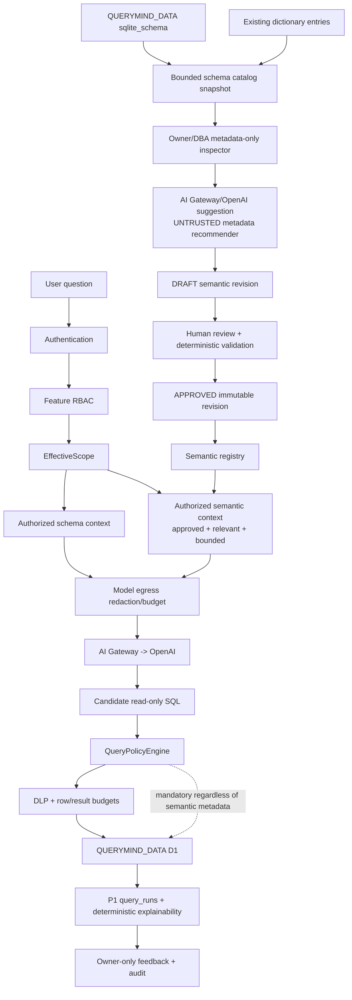

# QueryMind P2 — Governed Semantic Foundation

**Status:** P2-A through P2-D are implemented design-time stages. P2-E through
P2-H remain future work. P2-D is deliberately dark to the product runtime.

**P2-B implementation boundary:** The repository contains the local-only
governed design-time API surface documented in
`docs/releases/p2-b-semantic-governance-api.md`. It is limited to bounded
asset/revision/review metadata operations. Public approval, deprecation,
runtime semantic context, AI suggestions, and semantic evidence remain future
stages.

The implementation-sequence prose later in this document is historical
planning context where it lists approval/deprecation as P2-B work. The current
P2-B boundary is the routes and capabilities in the release report above:
approval and deprecation remain internal/future governance operations.

**P2-C implementation boundary:** The existing static SPA now provides a
capability-aware, design-time Semantic Registry at the `semantics` view. It
uses only the bounded P2-B `/api/v1/semantics` endpoints and the existing
authorized schema catalog endpoint for metadata selectors. It does not add a
semantic runtime context, model prompt input, AI suggestion call, SQL executor,
approval action, deprecation action, migration, role, or user. The detailed
release evidence is recorded in `docs/releases/p2-c-semantic-registry-ui.md`.

**Protected baseline:** P0 Governed Query Safety Core, P1 Explainable Query Experience, and the P1.1 production-quality patch remain frozen boundaries.

**Repository evidence:** This SDD is derived from the current repository, especially `docs/baselines/governed-query-baseline.md`, `docs/architecture/p2-semantic-foundation-investigation.md`, `docs/releases/p1.1-production-quality.md`, the P0/P1 SDDs and release reports, `cloudflare/src`, `cloudflare/public/app.js`, `cloudflare/wrangler.jsonc`, app migrations `0001`–`0008`, and data migration `0001`. The implementation is authoritative; this document records the approved P2-A persistence amendments and the future P2 design boundary.

## 1. Executive Summary

P2 adds a governed semantic registry for four canonical asset types: `TERM`, `DIMENSION`, `METRIC`, and `RELATIONSHIP`. The registry gives QueryMind a versioned, human-approved vocabulary and machine-readable metric/relationship contracts without turning semantic metadata into authorization.

The recommended first release uses normalized D1 tables for assets, immutable revisions, source references, aliases, relationship keys, and review decisions. AI is limited to an Owner/DBA design-time metadata recommender. It may create bounded `DRAFT` suggestions from an authorized schema snapshot and existing compatible glossary text, but it cannot approve, authorize, execute, or publish semantic truth. Only deterministic validation followed by a human approval can produce an `APPROVED` revision.

At runtime, the Worker resolves authentication, product capability, and `EffectiveScope` first. It then computes a bounded, relevance-filtered semantic context from approved revisions whose transitive table/column dependencies are authorized. The context is additive to the existing schema/glossary context. Candidate SQL still goes through the existing `QueryPolicyEngine`, DLP, result limits, and `QUERYMIND_DATA` D1 execution path. P2 does not implement P3 intent resolution or P4 planning/correctness.

## 2. Problem Statement

The current Worker has useful but thin semantic-like metadata:

- `schema_catalog_*` is a refreshed physical catalog derived from `QUERYMIND_DATA.sqlite_schema`.
- `dictionary_entries` provides bounded glossary text and the current UI/API compatibility surface.
- `query_templates` and `insights` are product content, not semantic authority.
- Physical foreign keys are displayed as schema hints, without approved business meaning, join-key governance, cardinality, or grain.
- P1 explainability is deterministic execution evidence, not a versioned definition of a metric.

Consequently, a user phrase such as “sales amount by product” can be described to the model, but QueryMind cannot yet record which formula, source mapping, grain, business filter, join key, or revision a human approved. Treating free-form glossary text or an LLM suggestion as authority would violate P0/P1 boundaries. P2 establishes that semantic truth in a reviewable, immutable, scope-filterable form.

## 3. Goals

P2 must:

1. Provide a versioned registry supporting `TERM`, `DIMENSION`, `METRIC`, and `RELATIONSHIP`.
2. Make approved revisions immutable and historically resolvable.
3. Provide a machine-readable Metric Contract with deterministic validation.
4. Formally represent an approved direct relationship, join key, and cardinality.
5. Store metric native grain in a bounded representation suitable for future P4 validation.
6. Support bounded metadata-only AI suggestions that remain drafts.
7. Require a human/data-owner approval before runtime consumption.
8. Filter semantic assets transitively through the caller’s `EffectiveScope` before model egress.
9. Preserve the existing dictionary APIs and glossary behavior during an additive migration.
10. Add future semantic evidence to P1 without rewriting historical query runs.
11. Keep the existing QueryPolicyEngine as the sole business SQL authorization and execution boundary.
12. Stay compatible with the current Cloudflare Worker + D1 Free-plan shape: bounded SQL, context, rows, bytes, requests, and D1 statements.

## 4. Non-Goals

P2 does not implement:

- Structured Query Intent (P3).
- A query planner, automatic join graph traversal, fan-out validation, or grain-correctness engine (P4).
- Complex query decomposition, retries, or user-intent changes.
- A Golden Evaluation framework, audit replay, shared execution cache, or result cache.
- Multi-provider routing, multi-agent architecture, Vectorize, RAG, a Knowledge Graph platform, or a central SaaS control plane.
- Full ABAC, SSO/OIDC, differential privacy, repeated-query inference protection, or result-retention policy decisions (Q82–Q85 remain open).
- ETL, arbitrary external connectors, writes, DDL, or write-enabled AI SQL.
- AI-generated row policies, authorization decisions, or data-scope changes.
- A replacement of `QueryPolicyEngine`, DLP, `EffectiveScope`, the schema catalog, or existing P1 UI behavior.

## 5. Current Architecture

The current production/runtime architecture is a single Worker entry point (`cloudflare/src/index.ts`) with static assets and two D1 bindings from `cloudflare/wrangler.jsonc`:

- `QUERYMIND_APP`: authentication, RBAC, sessions, schema catalog, dictionary, insights/templates, policy state/scopes, DLP metadata, audit, query runs, usage, and feedback.
- `QUERYMIND_DATA`: the read-only bundled business schema (`data/0001_initial_business_schema.sql`).

The relevant request flow is:

1. `index.ts` applies `assertStaticRuntimeConfiguration` to non-health requests and dispatches product APIs.
2. `requireUser` authenticates a session/JWT/API key; `requireCapability` enforces feature RBAC.
3. `resolveEffectiveScope` validates the P0 policy state (`expected_migration = '0006'`), scope rows, allowed columns, row-filter grammar, export flags, and query capability.
4. Chat (`routes/agent.ts`) resolves scope before `schemaContext`, `businessGlossary`, and conversation history. Direct query (`routes/query.ts`) and export/insight paths resolve scope before authorization.
5. The model receives bounded, redacted schema/glossary/history through the AI Gateway/OpenAI boundary. Model tool arguments are untrusted.
6. `authorizeQuery` obtains the catalog, validates read-only SQL, extracts physical sources/columns, checks the scope, rewrites deterministic row predicates, and reapplies bounded SQL validation.
7. Chat, direct query, and export execute only `validated.executionSql` on `QUERYMIND_DATA`. DLP inference checks/masking and result/API/stored-preview budgets remain active.
8. Successful governed executions persist `query_runs` and P1 explainability derived from deterministic runtime state. Feedback is owner-only, successful-run-only, and idempotent.

The only separate `QUERYMIND_DATA` access is the Owner/DBA browser-only schema refresh, which reads `sqlite_schema` metadata and updates the app catalog; it is not a business result executor and does not grant authorization.

### Current database baseline

The repository contains two forward-only migration streams. The verified latest app migration is `cloudflare/migrations/app/0009_semantic_governance_capabilities.sql`; P2-A introduced the semantic persistence migration `0008_governed_semantic_foundation.sql`, and `0009` grants the three bounded semantic capabilities to the existing DBA role. The latest data migration remains `cloudflare/migrations/data/0001_initial_business_schema.sql`; it defines the bundled business tables, including `products`, `orders`, `order_items`, and `support_tickets`. P0 policy state remains owned by app migration `0006_governed_query_safety.sql` (`expected_migration = '0006'`). P2-C adds no migration and does not modify P0/P1 migrations or the read-only data migration.

## 6. Target P2 Architecture

P2 adds design-time semantic governance and a scope-filtered runtime context while preserving the P0/P1 path:



Design-time AI and runtime AI are separate operations. Runtime retrieval is an internal Worker library call after `EffectiveScope`; it must not make a public/admin API round-trip or expose the full registry. An approved asset never expands a scope and never supplies a row predicate to the model.

## 7. Protected P0/P1 Boundaries

P2 must preserve these boundaries exactly:

| Boundary | P2 rule |
|---|---|
| Authentication | Semantic design-time APIs require an authenticated browser-session principal; API keys cannot manage or approve registry state. |
| Feature RBAC | P2-D reuses `manage_semantic_drafts` for its browser-session suggestion workflow; `view_semantics` alone cannot generate, view, dismiss, or accept suggestions. Future P2-E capabilities remain independent of data scope. |
| EffectiveScope | Resolve before catalog/semantic retrieval, source validation, model context construction, or business SQL authorization. Semantic visibility is derived from scope; it never modifies scope. |
| Authorized Catalog | Physical table/column/FK evidence comes from the existing refreshed catalog and is checked against the current scope. Stale/missing catalog references fail closed. |
| Model Egress Boundary | Metadata-only design-time input is bounded and redacted. No rows, credentials, tokens, scope keys, raw row predicates, or secrets are sent. Runtime semantic context is bounded with existing schema/glossary egress controls. |
| QueryPolicyEngine | Every model-produced SQL string continues through `authorizeQuery`/`authorizeReadOnlySql`. Semantic contracts are hints/metadata, not an authorization or executor. |
| D1 Execution | Business D1 execution remains only in governed chat/direct-query/export paths using `validated.executionSql`. P2 adds no executor. |
| DLP | DLP inference checks, masking, row caps, response/stored-preview budgets, and rate limits remain active. Semantic filters are not DLP or row policy. |
| Explainability | Only successful governed executions receive P1 explainability. Any semantic evidence is additive, immutable, and derived from the runtime revision IDs actually used. |
| Feedback | Existing owner-only, successful-run-only, idempotent feedback contract is unchanged. |

## 8. Semantic Asset Model

The first release has exactly four canonical types. Each asset has a stable `asset_id`; meaning is carried by one or more immutable revisions.

### TERM

A controlled business vocabulary item: canonical name, display label, bounded definition, aliases, locale/domain, and optional safe source references. A TERM does not contain executable calculation logic, authorization, row filters, or a claim that it is a metric. A source-backed TERM is runtime-visible only when every referenced table/column is authorized; an unbacked term can be visible only as a bounded, safe vocabulary hint.

### DIMENSION

An approved analytical grouping/filtering concept. The minimum approved contract is one valid source mapping (`TABLE.COLUMN` or a bounded, validated source reference), display/definition metadata, data type, optional native entity/grain, and a constrained allowed-operation set (`GROUP`, `FILTER`, `ORDER`, with time roles represented structurally). P2 does not compile arbitrary dimension SQL.

### METRIC

A machine-readable calculation contract. It must identify all source fields and dependencies, a constrained expression tree, business default filters, native grain, unit/currency, optional time dimension, ownership, and revision/status. Authorization and data-scope predicates are explicitly excluded from the contract.

### RELATIONSHIP

An approved direct relationship between two source endpoints with one or more ordered join-key pairs, a cardinality, a business label, and source evidence. It is a governed semantic hint for future intent/planning and explainability; it is not a general join graph and cannot cause execution by itself. Only approved revisions are runtime-visible.

## 9. Semantic Revision Model

### Recommendation

Use `semantic_assets` as stable identity/ownership and `semantic_revisions` as an append-only revision stream. Revision state is authoritative; the asset stores a denormalized pointer/status for efficient listing.

Advantages:

- Stable IDs allow P1 query runs and future release identity to reference an exact meaning.
- Old approved revisions remain readable after a replacement or deprecation.
- Draft editing cannot mutate production truth.
- Common lifecycle/audit fields are normalized once, while type-specific contracts stay in validated JSON.
- SQLite/D1 supports the design with ordinary PK/FK/UNIQUE/CHECK constraints and bounded JSON payloads.

Trade-off: runtime queries join multiple tables and approval must update the revision plus asset pointer transactionally. That complexity is preferable to silently mutating a metric’s meaning.

### Lifecycle

Asset and revision lifecycles are deliberately separate. `semantic_assets.asset_status` is only `ACTIVE` or `DEPRECATED`; it never mirrors draft or review state. `semantic_assets.current_approved_revision_id` is a nullable pointer to the revision used by future runtime selection. `semantic_revisions.revision_status` is `DRAFT`, `IN_REVIEW`, `APPROVED`, or `REJECTED`. An ACTIVE asset may therefore keep Rev 3 as current while Rev 4 is DRAFT or IN_REVIEW. Deprecation preserves historical revisions and only removes the asset from future selection. Approved revisions are immutable; a meaning change creates a higher revision number.

For concurrency, approval is a transactional conditional update: it succeeds only when the revision is still `IN_REVIEW`, the expected revision number/status matches, and deterministic validation passes. A competing update returns a conflict (HTTP 409 in a future API).

No hard delete is allowed for an approved or referenced revision. Unreferenced draft cleanup, if later needed, must be a separate retention decision and must not delete history required by query runs.

## 10. Metric Contract

The following is the proposed TypeScript-level contract. It is an interface design, not current source code:

```ts
type SourceRef = {
  table: string;
  column: string;
};

type GrainRef =
  | { kind: "ENTITY"; key: string; source: { table: string; keyColumns: string[] } }
  | { kind: "TIME"; key: string; source: SourceRef; timeUnit: "day" | "week" | "month" | "quarter" | "year" };

type Scalar = string | number | boolean | null;

type BusinessFilter = {
  field: SourceRef;
  operator: "EQ" | "NEQ" | "IN" | "NOT_IN" | "IS_NULL" | "IS_NOT_NULL";
  value?: Scalar | Scalar[];
};

type MetricExpression =
  | { kind: "COLUMN"; source: SourceRef }
  | { kind: "LITERAL"; value: Scalar }
  | { kind: "ADD" | "SUBTRACT" | "MULTIPLY" | "DIVIDE"; left: MetricExpression; right: MetricExpression; divisionByZero?: "NULL" }
  | { kind: "SUM" | "AVG" | "MIN" | "MAX"; argument: MetricExpression }
  | { kind: "COUNT"; mode: "ROWS" }
  | { kind: "COUNT"; mode: "COLUMN"; source: SourceRef }
  | { kind: "COUNT_DISTINCT"; source: SourceRef };

interface MetricContract {
  canonicalName: string;
  displayName: string;
  definition: string;
  domain: string;
  sources: Array<{ ref: SourceRef; role: "value" | "join" | "filter" | "time" }>;
  expression: MetricExpression;
  defaultFilters: BusinessFilter[];
  nativeGrain: GrainRef;
  timeDimension?: SourceRef;
  unit: "COUNT" | "CURRENCY" | "QUANTITY" | "PERCENT" | "RATING" | "UNKNOWN";
  currency?: string;
  semanticDependencies: Array<{ referencedAssetId: string; referencedRevisionId: string }>;
}
```

### Expression recommendation

Choose **B/C in a bounded form**: a constrained structured expression tree is canonical; a deterministic Worker compiler may later render it to SQL for an approved, supported query plan. A draft may retain a raw AI suggestion as non-executable evidence, but an approved contract must not contain arbitrary SQL as trusted executable code. The validator must cap expression depth, node count, source references, operators, and literal lengths. Unsupported expressions remain `DRAFT`/`IN_REVIEW`.

This is safer and more portable for Worker/D1 than trusting raw SQL, while remaining explainable and future-planner compatible. P2 does not implement the compiler or planner; it establishes the contract and validation boundary.

### Business filters vs authorization

`defaultFilters` are business calculation rules, for example `orders.status NEQ 'cancelled'`. They are stored in a distinct field and AST shape from P0 row policies. They must never encode `data_scope_key`, authorization predicates, department/region access, or a user-specific condition. At a later planning stage, a deterministic compiler may combine a metric’s business filters with a separately generated query, but `EffectiveScope` row policies are independently applied by `QueryPolicyEngine` and must win if the two concerns conflict.

## 11. Relationship + Join Key + Cardinality

P2 formally supports a direct approved relationship and approved join key. A relationship revision contains:

- left source table and right source table;
- one or more ordered key pairs (`leftColumn`, `rightColumn`), allowing composite keys only when every pair validates;
- label/definition and optional direction (`left_to_right` for display only);
- cardinality enum: `ONE_TO_ONE`, `ONE_TO_MANY`, `MANY_TO_ONE`, `MANY_TO_MANY`;
- schema snapshot/source evidence and lifecycle/review metadata.

The first release allows direct relationships only. Composite keys are allowed as a set of bounded pairs. Multi-hop relationships, conditional joins, calculated join keys, preferred-path selection, and fan-out checks are deferred to P4. A physical FK is evidence for a suggestion, not automatic approval. A relationship cannot participate in runtime semantic context if either endpoint table or any join-key column is outside the caller’s scope or absent from the current catalog.

## 12. Grain Model

Use the bounded `GrainRef` above rather than free text. `ENTITY` grain requires a canonical key plus a physical table and one or more physical key columns; `TIME` grain requires a physical source column and a fixed time unit. A METRIC must declare `nativeGrain` before approval. A DIMENSION may declare an anchored entity grain. P2-A validates identifiers and shape; catalog existence/staleness is checked by the later approval layer.

Examples include `ENTITY(order)`, `ENTITY(order_item)`, `ENTITY(product)`, `ENTITY(customer)`, and `TIME(day|month)`. P2 stores and validates the reference; P4 later validates fan-out, expected output grain, and join correctness. Cardinality/grain metadata never grants access or proves a result correct by itself.

## 13. AI Schema Intelligence

The design-time workflow is:

1. Owner/DBA authenticates with browser session and the future semantic-suggestion capability.
2. The current schema refresh produces a bounded catalog snapshot. Only DDL metadata, table/column types, physical FK metadata, and explicitly permitted existing glossary text are selected.
3. The Worker redacts/bounds content and sends a metadata-only request through the existing AI Gateway/OpenAI egress boundary. Provider/model/prompt release identity is recorded as bounded metadata.
4. The model returns a strict structured suggestion set. The response is parsed as untrusted data and stored as `DRAFT` revisions.
5. A human checks source mapping, expression, business filters, grain, unit, relationship keys/cardinality, domain, and evidence before submitting for review/approval.

AI input must never include business rows, sample values by default, credentials, tokens, secrets, `scopeKey`, raw row predicates, or unrestricted prompts. Database DDL/comments are untrusted metadata and must be delimited and explicitly described as data; malicious comments cannot become instructions or approval.

Suggested evidence statuses are qualitative and review-oriented: `HIGH_EVIDENCE`, `REVIEW_REQUIRED`, `AMBIGUOUS`. Do not store fake numeric confidence percentages. A suggestion that includes an unauthorized source, row policy, authorization claim, arbitrary SQL, or unsupported type is rejected or remains non-approvable.

## 14. Human Review / Approval Workflow

Recommended capabilities, added only if required by the existing finite product capability pattern:

- `view_semantics`: list/read approved assets visible to the caller.
- `manage_semantic_drafts`: create/edit/submit drafts and manage P2-D suggestions.
- `approve_semantics`: approve/reject/request changes/deprecate, normally Owner/Data Owner.

P2-D intentionally did not introduce a `generate_semantic_suggestions`
capability: the existing draft-governance capability is the narrow product
boundary for generation, listing, dismissing, and accept-as-Draft.

Recommended flow:

`AI suggestion → DRAFT → edit → IN_REVIEW → deterministic validation → approve or request changes/reject → APPROVED immutable revision`.

Only a human principal with `approve_semantics` can approve. The Worker must revalidate source references against the current catalog and policy-independent schema facts at approval time; a suggestion’s evidence or model confidence cannot override validation. Every transition records an audit event with bounded metadata, actor, revision ID, and schema/model release identity.

## 15. EffectiveScope Integration

The runtime order is mandatory:

`requireUser → requireCapability → resolveEffectiveScope → load approved revisions → transitive dependency filter → relevance/budget filter → model egress`.

Deterministic availability rules:

1. Select only revisions with `status = APPROVED`; draft, in-review, rejected, and deprecated revisions are absent from new runtime context.
2. A source reference is usable only if its table exists in the current authorized catalog and its column is allowed by `EffectiveScope` (or the table policy is `*`).
3. A `DIMENSION` is available only when every source and optional grain/time reference is authorized.
4. A `METRIC` is available only when every `sources` entry, expression leaf, default-filter field, time dimension, and referenced semantic dependency is authorized and present.
5. A `RELATIONSHIP` is available only when both endpoint tables and all join-key columns are authorized and present. Missing one side removes the relationship; it is never partially exposed.
6. A source-backed `TERM` is available only when all source references are authorized. A source-free TERM may be included only as bounded vocabulary and cannot become executable meaning.
7. Dependency closure is transitive. If a metric depends on a dimension/term/relationship that is unavailable, the metric is unavailable unless the dependency is explicitly marked descriptive-only and does not affect calculation.
8. An asset must match the current schema snapshot identity or be marked stale and excluded under the configured fail-closed policy. P2 does not invent a refresh fallback.
9. No semantic asset may add a table, column, row predicate, export flag, capability, or scope key to `EffectiveScope`.

Example: if Metric A references `orders.total_amount` and `customers.region`, a caller lacking `customers.region` receives neither the metric nor a partial contract. This prevents leakage through names, formulas, or inferred relationships.

## 16. Authorized Semantic Context

Runtime retrieval should be an internal `authorizedSemanticContext(env, scope, prompt)` library call, invoked after scope resolution and before the system prompt is assembled. It should:

- query only approved revisions and their bounded dependency rows;
- tokenize/search canonical names, display names, aliases, domains, and safe definitions deterministically against the user prompt;
- preserve a stable order (asset type, relevance score from deterministic token matches, updated/revision number, canonical name);
- emit compact blocks such as `Terms`, `Dimensions`, `Metrics`, and `Relationships`, with asset ID/revision ID, display name, bounded definition/contract summary, and authorized source labels;
- omit full raw payloads, row-policy text, scope keys, secret-like values, and unneeded aliases.

Initial guardrails should be explicit and configurable: at most 20 TERMS, 12 DIMENSIONS, 12 METRICS, 12 RELATIONSHIPS, and 32 KB serialized semantic context, in addition to the existing 32,000-character schema context and glossary bounds. If the budget is exceeded, truncate deterministically and record a bounded internal reason; never silently broaden the selection. No Vector DB/RAG is needed for the first version.

### Golden design fixture: 「請依商品列出銷售額」

The current data migration provides `products`, `order_items`, and `orders`, with physical foreign keys `order_items.product_id → products.id` and `order_items.order_id → orders.id`. The existing dictionary and mock path support the bounded demo convention `SUM(order_items.subtotal)` with cancelled orders excluded. The physical fields also make `quantity * unit_price` a plausible **CURRENT DEMO PROPOSAL**, but P2 must not declare either formula as universal enterprise truth without a human-approved Metric Contract.

The intended future flow is:

`DDL/catalog snapshot → AI suggests TERM(銷售額), DIMENSION(product), METRIC(sales_revenue), and direct RELATIONSHIP revisions → human reviews source mappings, formula, default business filter, native grain, unit, join keys, and cardinality → APPROVED revisions → EffectiveScope removes any unauthorized dependency → bounded semantic context → LLM proposes read-only SQL → QueryPolicyEngine/DLP/D1 → P1 deterministic explainability with exact semantic revision IDs`.

P2 stops before intent resolution and query planning. It records the evidence needed for those later milestones; it does not invent a join path or execute a metric contract directly.

## 17. Dictionary Backward Compatibility

Choose **Option C: coexist temporarily**, with an additive compatibility bridge.

- Keep `GET/POST/PUT/DELETE /api/v1/dictionary`, `dictionary_entries`, the existing Owner/DBA capability, UI, seeded terms, and `businessGlossary` output unchanged initially.
- Treat legacy dictionary text as glossary context, not approved semantic truth. Existing entries can be explicitly promoted by a DBA into a `TERM` draft; promotion must not auto-approve a metric or formula.
- A future adapter may read approved TERM assets alongside legacy entries, but must keep the existing glossary format and scope/source-column filtering while both systems coexist.
- Do not delete or rewrite `dictionary_entries` in 0008. Do not silently convert the seeded `revenue` wording or `SUM(order_items.subtotal)` example into a universal approved enterprise Metric Contract.
- After compatibility tests prove parity and a later product decision approves cutover, legacy entries may be deprecated as an API implementation detail. That is outside this SDD task.

Existing templates and insights remain product content. Insight SQL is still authorized when saved and re-authorized on each execution; semantic metadata cannot make saved SQL permanently authorized.

## 18. P1 Explainability Integration

P2 should reserve an additive future evidence shape, without implementing it now:

```ts
type SemanticEvidence = {
  semanticVersion: string;
  assets: Array<{
    assetId: string;
    revisionId: string;
    assetType: "TERM" | "DIMENSION" | "METRIC" | "RELATIONSHIP";
    canonicalName: string;
  }>;
};
```

When a future governed execution actually uses an approved revision, `query_runs.explainability_json` may add `semanticEvidence` and a release identity containing application version, model config/release, prompt version, semantic version, and policy version. The exact revision IDs used must be stored, not just the current metric label. Historical P1 runs remain immutable and render their existing envelope even if an asset is deprecated or superseded. Explainability must not show draft status, scope keys, raw row predicates, secrets, credentials, or unbounded contract payloads.

## 19. Proposed Database Schema

Migration `cloudflare/migrations/app/0008_governed_semantic_foundation.sql` is the additive implementation. Existing migrations `0001`–`0007`, especially `0006`, remain untouched. P2-A does not add routes, capabilities, runtime semantic context, or deployment configuration.

### `semantic_registry_state`

The singleton row `state_key = 'global'` starts at `registry_version = 0`. The repository increments the version only during approval activation or ACTIVE-asset deprecation; draft edits, review events, and rejected revisions do not increment it.

### `semantic_assets`

Purpose: stable identity, ownership, type, and listing state.

Proposed columns:

- `asset_id TEXT PRIMARY KEY` (UUID/opaque stable ID).
- `asset_type TEXT NOT NULL CHECK (asset_type IN ('TERM','DIMENSION','METRIC','RELATIONSHIP'))`.
- `canonical_name TEXT NOT NULL` (normalized identifier; uniqueness should be `(asset_type, canonical_name, domain)` to permit domain-specific names).
- `display_name TEXT NOT NULL`, `domain TEXT NOT NULL DEFAULT ''`, `description TEXT NOT NULL DEFAULT ''`.
- `owner_user_id TEXT NOT NULL REFERENCES users(id) ON DELETE RESTRICT`.
- `current_approved_revision_id TEXT` (denormalized pointer; application-level transactional validation avoids a circular FK).
- `asset_status TEXT NOT NULL CHECK (asset_status IN ('ACTIVE','DEPRECATED'))`; draft/review state belongs only to revisions.
- `created_by TEXT NOT NULL REFERENCES users(id) ON DELETE RESTRICT`, `created_at TEXT NOT NULL`, `updated_at TEXT NOT NULL`, `deprecated_at TEXT`.

Constraints/indexes: unique normalized identity; index `(asset_type,status,updated_at DESC)` and owner/status. No hard delete for approved/referenced assets.

### `semantic_revisions`

Purpose: immutable type-specific contract and lifecycle source of truth.

Proposed columns:

- `revision_id TEXT PRIMARY KEY`.
- `asset_id TEXT NOT NULL REFERENCES semantic_assets(asset_id) ON DELETE RESTRICT`.
- `revision_number INTEGER NOT NULL CHECK (revision_number > 0)`.
- `revision_status TEXT NOT NULL CHECK (revision_status IN ('DRAFT','IN_REVIEW','APPROVED','REJECTED'))`.
- `payload_json TEXT NOT NULL CHECK (json_valid(payload_json))` (validated against the asset type by Worker code; bounded length).
- `schema_snapshot_id TEXT NOT NULL` (from `schema_catalog_state`).
- `change_reason TEXT NOT NULL DEFAULT ''`, `created_by TEXT NOT NULL REFERENCES users(id) ON DELETE RESTRICT`, `created_at TEXT NOT NULL`.
- `submitted_by TEXT`, `submitted_at TEXT`, `approved_by TEXT`, `approved_at TEXT`, `deprecated_at TEXT` (foreign keys to users with `ON DELETE RESTRICT` if present).

Constraints/indexes: `UNIQUE(asset_id, revision_number)`; indexes `(asset_id,status,revision_number DESC)` and `(status,asset_id)`. Asset type/status listing uses `semantic_assets(asset_type,status,updated_at)` and joins by `asset_id`; no impossible `asset_type` column is required on the revision table. Approved rows are append-only; updates are limited to lifecycle metadata by guarded Worker operations. No cascade deletion.

### `semantic_sources`

Purpose: normalized source/dependency references for deterministic scope filtering and validation.

Columns: `source_id TEXT PRIMARY KEY`, `revision_id TEXT NOT NULL REFERENCES semantic_revisions(revision_id) ON DELETE RESTRICT`, `source_kind TEXT NOT NULL CHECK (source_kind IN ('TABLE','COLUMN','SEMANTIC_DEPENDENCY'))`, `table_name TEXT`, `column_name TEXT`, `referenced_asset_id TEXT`, `referenced_revision_id TEXT`, `role TEXT NOT NULL`, `ordinal_position INTEGER NOT NULL`, `created_at TEXT NOT NULL`.

Require either a physical table/column reference or a semantic dependency, never an arbitrary SQL predicate. A semantic dependency must carry both `referenced_asset_id` and `referenced_revision_id` and the repository verifies that the pinned revision is APPROVED and belongs to that asset. Add indexes on `(revision_id)` and `(table_name,column_name)`.

### `semantic_aliases`

Purpose: bounded canonical/locale aliases used for deterministic relevance and compatibility.

Columns: `alias_id TEXT PRIMARY KEY`, `revision_id TEXT NOT NULL REFERENCES semantic_revisions(revision_id) ON DELETE RESTRICT`, `alias TEXT NOT NULL`, `normalized_alias TEXT NOT NULL`, `locale TEXT NOT NULL DEFAULT ''`, `created_at TEXT NOT NULL`.

Unique `(revision_id, normalized_alias, locale)` and an index on `normalized_alias`. Alias conflicts across approved assets in the same domain must be surfaced for review; aliases never grant authorization.

### `semantic_relationship_keys`

Purpose: ordered approved key pairs for RELATIONSHIP revisions.

Columns: `revision_id TEXT NOT NULL REFERENCES semantic_revisions(revision_id) ON DELETE RESTRICT`, `ordinal_position INTEGER NOT NULL`, `left_table TEXT NOT NULL`, `left_column TEXT NOT NULL`, `right_table TEXT NOT NULL`, `right_column TEXT NOT NULL`, `created_at TEXT NOT NULL`.

Primary key `(revision_id, ordinal_position)`; uniqueness over all key fields; indexes on both endpoint pairs. Composite keys are represented by multiple rows. No conditional predicate or arbitrary expression column is permitted in the first release.

### `semantic_reviews`

Purpose: immutable human review decisions and bounded comments.

Columns: `review_id TEXT PRIMARY KEY`, `revision_id TEXT NOT NULL REFERENCES semantic_revisions(revision_id) ON DELETE RESTRICT`, `action TEXT NOT NULL CHECK (action IN ('SUBMITTED','APPROVED','REJECTED','REQUEST_CHANGES','DEPRECATED'))`, `reviewer_user_id TEXT NOT NULL REFERENCES users(id) ON DELETE RESTRICT`, `comment TEXT NOT NULL DEFAULT ''`, `created_at TEXT NOT NULL`.

Index `(revision_id,created_at DESC)` and `(reviewer_user_id,created_at DESC)`. Comments are length-limited; secrets, rows, predicates, prompts, and credentials are prohibited.

### D1/SQLite implementation notes

The migration follows the repository's forward-only `CREATE TABLE IF NOT EXISTS`/index convention and does not depend on a new `PRAGMA foreign_keys` side effect. SQLite cannot enforce every cross-table semantic validation or immutable-row rule; the Worker validates contracts and uses guarded conditional updates. A composite FK pins `semantic_sources` to the exact `(asset_id, revision_id)` pair. No `ON DELETE CASCADE` is used for semantic revisions or source/review evidence because it could erase historical meaning.

### P2-A schema-catalog provenance

The existing `schema_catalog_state` originally contained `id`, `source_schema_version`, `refreshed_at`, and `table_count`; it did not expose a stable snapshot identity. Migration 0008 adds `schema_snapshot_id`, defaulting to `uninitialized` until the next refresh. `refreshSchemaCatalog` now computes a SHA-256 hash of sorted filtered table names and CREATE TABLE SQL and persists that hex identity. It does not add catalog history or change schema filtering/prompt behavior. Semantic revisions store this exact identity for later stale-catalog approval checks.

`semantic_sources` is normalized to `TABLE`, `COLUMN`, and `SEMANTIC_DEPENDENCY`; metric expression leaves, filters, time dimensions, and grain anchors produce `COLUMN` rows, while semantic references store both exact asset and revision IDs. Executable SQL, row predicates, scope keys, and an `EXPRESSION` source kind are not persisted.

## 20. Proposed API Contracts

These are future contracts; they are not routes in the current Worker.

### Design-time/admin APIs

| Method/path | Capability and purpose | Result/constraints |
|---|---|---|
| `GET /api/v1/semantics?type=&status=` | `view_semantics`; list approved assets visible to the caller, or Owner/DBA design-time states | Bounded page; no whole-registry dump by default. |
| `GET /api/v1/semantics/:id` | `view_semantics` or owner/reviewer | Returns bounded current revision, source mapping, review-safe history; never raw row predicates/secrets. |
| `POST /api/v1/semantics` | `manage_semantic_drafts` | Creates TERM/DIMENSION/METRIC/RELATIONSHIP DRAFT only; validates shape and ownership. |
| `POST /api/v1/semantics/:id/revisions` | `manage_semantic_drafts` | Creates the next immutable DRAFT revision; cannot edit APPROVED in place. |
| `POST /api/v1/semantics/:id/submit-review` | `manage_semantic_drafts` | Conditional DRAFT→IN_REVIEW after deterministic validation precheck. |
| `POST /api/v1/semantics/:id/approve` | `approve_semantics` | Conditional IN_REVIEW→APPROVED; revalidates catalog/dependencies and records reviewer. 409 on race. |
| `POST /api/v1/semantics/:id/reject` | `approve_semantics` | Records rejection/request changes; no published truth. |
| `POST /api/v1/semantics/:id/deprecate` | `approve_semantics` | Removes from future runtime selection; preserves history. |
| `POST /api/v1/semantics/suggestions/generate` | `manage_semantic_drafts` + browser session | Metadata-only, bounded, rate-limited; returns/stores immutable OPEN suggestions, never a DRAFT. |

### Runtime internal contract

`authorizedSemanticContext(env, scope, prompt)` is an internal library call, not a public route. It must run after `resolveEffectiveScope`, use only approved revisions, apply transitive dependency filtering and context budgets, and return a deterministic serialized block. Runtime should not call the admin API or expose a registry endpoint to the model.

### API errors

Malformed contract/source → 400; missing/stale catalog or policy dependency → 503/409 fail-closed; unauthorized capability → 403; unavailable scoped asset → omitted rather than disclosed; approval race → 409; AI Gateway failure → bounded 502/504 with no partial approval.

## 21. Proposed UI / UX

Add a compact Owner/Data Owner area without redesigning the SPA:

- **Semantic Registry** page with tabs/filters for Terms, Metrics, Dimensions, and Relationships.
- Row summary: canonical/display name, type, domain, owner, lifecycle status, revision number, schema snapshot, updated time.
- Detail view: definition, aliases, source mapping, structured metric/relationship contract, grain/cardinality, validation findings, revision history, and review decisions.
- **AI Suggestions** is visibly separate from Approved Semantics. Each suggestion shows “AI suggested / evidence status / human action required”; it never looks approved.
- Actions are capability-gated: edit draft, submit review, approve/reject/request changes, deprecate. Approved cards are read-only; “new revision” is the only change path.
- Avoid displaying scope keys, raw row predicates, credentials, full prompts, or raw business rows. Display authorized source labels only.

The existing schema, dictionary, templates, insights, query result, explainability, and feedback UI remain compatible. A future runtime query screen may show approved metric/revision evidence only when the Worker returns it from a successful governed execution.

## 22. Validation Rules

Validation is deterministic and fail-closed; AI evidence/confidence cannot override it.

### Common

- Canonical/display names are non-empty, bounded, normalized, and safe for the chosen domain uniqueness rule.
- Payload is valid JSON, within byte/depth/node/literal limits, and matches the declared asset type.
- Owner/reviewer IDs exist and capabilities are checked.
- Schema snapshot exists; every physical source is present in the catalog with valid identifier syntax.
- No payload field may contain a row policy, scope key, credential, secret, token, or executable arbitrary SQL.

### TERM

- Canonical name required; aliases bounded and unique per locale/revision.
- If source-backed, all source table/columns exist; no expression/calculation required.

### DIMENSION

- At least one valid source mapping; source type and allowed operations are from finite enums.
- Optional time role/grain is structurally valid; no arbitrary source SQL.

### METRIC

- Every expression leaf and `sources` role maps to an existing catalog source.
- Expression uses only the allowed AST kinds and bounded depth.
- `defaultFilters` use only finite operators and scalar/list values; they are business filters, never row-policy fields.
- `nativeGrain` is required and structurally valid; `unit`/currency combinations are coherent.
- Referenced semantic dependencies resolve to APPROVED compatible revisions at approval time.

### RELATIONSHIP

- Both endpoint tables exist; every ordered key pair exists in the catalog and is scope-checkable.
- Cardinality is one of the four enumerated values.
- At least one join-key pair; composite keys are complete and bounded.
- No multi-hop, conditional, arbitrary expression, or AI-authored policy.

Approval is impossible if validation fails, a source is dropped, a dependency is unauthorized/unknown, or the schema snapshot is stale under the configured policy.

## 23. Audit Events

Reuse `lib/audit.ts` and `audit_events`. At minimum emit:

- `semantic.suggestion.generated`
- `semantic.draft.created`
- `semantic.revision.updated`
- `semantic.review.submitted`
- `semantic.revision.approved`
- `semantic.revision.rejected`
- `semantic.revision.request_changes`
- `semantic.revision.deprecated`
- `semantic.asset.promoted` (only if explicit dictionary-to-TERM promotion is implemented)

Audit metadata should contain actor ID, asset/revision ID, type, action, schema snapshot version, semantic/model/prompt release IDs, and bounded validation outcome. Never log prompts, rows, raw filters, scope keys, credentials, tokens, or free-form comments in audit metadata. P1 query audit remains unchanged.

## 24. Failure Modes

| Failure | Required behavior |
|---|---|
| Malformed JSON/type payload | Keep as DRAFT or reject with bounded 400; never runtime-visible. |
| Missing source mapping/unknown column | Approval fails closed; runtime asset omitted. |
| Dropped table or stale schema snapshot | Mark validation stale; omit from runtime until refreshed/re-reviewed. |
| Unauthorized column/table dependency | Asset omitted for that caller; do not reveal the missing dependency as a bypass hint. |
| Approved relationship missing join key | Runtime relationship omitted; approval of a new revision fails. |
| Deprecated asset | Excluded from new context but remains resolvable for historical evidence. |
| AI Gateway unavailable | Return bounded design-time error; no partial DRAFT approval or fabricated result. |
| Conflicting aliases/duplicate canonical names | Reject or require human resolution; no ambiguous runtime selection. |
| Approval race | Conditional transaction returns 409; preserve both immutable histories. |
| Unsupported expression/conditional join | Remain non-approvable DRAFT/IN_REVIEW; no raw SQL fallback. |
| Runtime context over budget | Deterministically truncate/omit lower-ranked assets and record bounded internal diagnostics. |

## 25. Security Threat Analysis

- **Semantic registry as authorization:** prevented by deriving all visibility from `EffectiveScope` and retaining `QueryPolicyEngine` as the execution gate.
- **Unauthorized source leakage through metric formulas:** prevented by transitive source/dependency filtering before egress; unavailable assets are omitted, not partially summarized.
- **Prompt injection in DDL/comments/dictionary:** metadata is untrusted, bounded, delimited, and never an instruction or approval authority.
- **AI-generated row policies or permissions:** contract schema has no row-policy/authorization fields; validation rejects them; policy state remains runtime-owned.
- **Arbitrary SQL in a metric:** approved payload accepts only constrained AST; raw suggestion text is non-executable evidence.
- **Stale catalog / dropped fields:** approval and runtime check current snapshot/source existence; fail closed.
- **Revision tampering / history loss:** append-only revisions, `ON DELETE RESTRICT`, audit records, and no hard delete of referenced history.
- **Scope/context cache confusion:** P2 has no shared query cache; future semantic cache keys must include identity/scope/policy/semantic/schema versions as specified by the open cache principles.
- **Sensitive metadata in audit/explainability:** bounded allowlisted metadata; no scope keys, predicates, secrets, credentials, rows, or prompts.
- **Denial-of-service/cost:** design-time suggestion rate limits, metadata/context byte and item bounds, existing AI Gateway/Worker timeouts, and D1 statement budgets.
- **Write execution:** no write-enabled SQL or new data executor is introduced.

## 26. Migration Strategy

1. Architecture review approves this SDD and any capability names.
2. P2-A has created the forward-only app migration `0008_governed_semantic_foundation.sql`, containing only additive semantic tables/indexes/constraints; do not rewrite `0001`–`0007` or data migration `0001`.
3. Deploy schema before code that reads it; verify disposable D1 and remote migration state read-only first.
4. Add dual-read compatibility: existing dictionary/glossary paths remain operational; semantic registry starts empty or with explicitly imported DRAFT TERM records.
5. Backfill legacy dictionary terms only as DRAFT/compatibility records when an operator explicitly requests it; never auto-approve a formula or source mapping.
6. Add design-time APIs/UI and tests before enabling runtime semantic context.
7. Gate runtime context behind a feature flag/config that fails back to existing authorized schema/glossary if disabled.
8. Add P1 semantic evidence only after exact revision IDs can be persisted atomically with successful governed runs.

Migration validation must cover foreign keys, JSON checks, uniqueness, indexes, immutable-history semantics, bounded payloads, and migration order in a disposable D1.

## 27. Rollback Strategy

If P2 code or context behavior regresses, disable the semantic-context feature flag and fall back to the existing scope-filtered schema/glossary path. Existing P0/P1 query execution, DLP, explainability, and feedback continue to operate.

Do not delete semantic tables or rewrite migrations to roll back. Preserve draft/approved history. If a schema migration has applied but code is rolled back, unused additive tables are harmless; the old Worker must not query them. If approval/runtime validation fails, stop the rollout and keep only existing P0/P1 behavior. For a Worker regression, use the existing version rollback runbook; do not roll back D1 data automatically.

## 28. Test Strategy

Tests must be added before enabling runtime semantic context and must keep the complete P0/P1 suite green.

**A. Migration:** disposable D1 applies app/data migrations 0001–0009; JSON/CHECK/FK/unique/index assertions; no changes to 0006; schema catalog and policy health remain valid.

**B. Asset CRUD:** type-specific create/read/update-draft/list; bounded fields; ownership/capability checks; no hard delete of referenced history.

**C. Lifecycle:** assets are only ACTIVE/DEPRECATED while revisions are DRAFT/IN_REVIEW/APPROVED/REJECTED; an ACTIVE asset can retain its current approved pointer while a new draft is edited; stale/racing transitions return 409; approved revisions cannot be edited in place; asset deprecation preserves history.

**D. EffectiveScope:** fully authorized assets included; unauthorized table/column dependencies omitted; transitive dependency removal; deprecated/draft exclusion; stale catalog fail closed; source-free TERM bounded behavior.

**E. Relationships:** direct join keys, composite keys, cardinality enum; missing endpoint/key rejection; no multihop/conditional join approval.

**F. Grain/cardinality:** valid entity/time grain; required metric grain; bounded units/currency; cardinality stored but no P4 fan-out claim.

**G. Metric Contract:** bounded expression AST validation, safe physical identifier/grain anchors, business-filter grammar, no arbitrary SQL, no row policy/authorization fields, and exact approved dependency pinning. Catalog existence/staleness enforcement belongs to the later approval stage.

**H. AI boundary:** metadata-only request fixtures; no rows/secrets/tokens/predicates; structured output parser; Gateway failure and malformed response; qualitative evidence status; AI cannot approve.

**I. Injection:** malicious DDL/comments/dictionary values cannot change system instructions, publish drafts, add permissions, or bypass policy.

**J. Compatibility:** existing dictionary CRUD/list/glossary output; seeded term behavior; templates/insights; current schema refresh; existing role/capability UI.

**K. P1 regression:** successful explainability remains deterministic; failed/rejected executions have no card; SQL capability gate; historical runs unaffected; owner-only idempotent feedback; additive semantic evidence shape only when explicitly provided.

**L. P0 regression:** unauthorized table/column/wildcard/row access, prompt-injection independence, read-only SQL, DLP, caps, export, saved-insight revalidation, production fail-closed config, and exactly the existing governed D1 execution sites.

Also run typecheck, unit/security, product/RBAC E2E, disposable D1, Worker startup/dry-run, frontend syntax, and deployment smoke only during the later implementation/rollout stages. This SDD task does not deploy.

## 29. Production Rollout Plan

Future rollout sequence:

1. Architecture review and explicit approval of any capability names/ownership model.
2. Additive migration in disposable D1; local regression and schema-health verification.
3. Implement persistence and validation; run unit/security tests.
4. Implement governance APIs/audit and Owner/Data Owner UI; keep runtime flag off.
5. Implement metadata-only AI suggestions with Gateway/rate/budget controls; verify no business rows leave D1.
6. Implement human review/approval; verify immutable revisions and conflict handling.
7. Implement scope-filtered semantic context behind a disabled-by-default flag; run P0/P1 regression and golden fixture tests.
8. Staging/preview smoke with mock AI, then authenticated production canary with real Gateway/BYOK configuration.
9. Observe context size, Gateway errors, approval failures, policy denials, and D1 budgets; progressively enable only after evidence.
10. Roll back by disabling semantic context or Worker version; never weaken P0/P1 or delete semantic history.

No production deployment is part of this document task.

## 30. Acceptance Criteria

The later implementation is acceptable only when it demonstrates:

1. A versioned semantic registry exists.
2. `TERM`, `DIMENSION`, `METRIC`, and `RELATIONSHIP` are supported.
3. RELATIONSHIP supports approved join keys.
4. RELATIONSHIP stores cardinality.
5. METRIC supports the machine-readable Metric Contract.
6. METRIC stores native grain.
7. AI generates bounded DRAFT suggestions from schema metadata only.
8. AI cannot publish semantic truth.
9. Human approval is required.
10. Only APPROVED revisions reach runtime context.
11. `EffectiveScope` filters semantic assets before model egress.
12. An unauthorized semantic dependency makes an asset unavailable.
13. `QueryPolicyEngine` remains mandatory for every SQL execution.
14. Existing dictionary behavior and APIs remain backward compatible.
15. Existing P0/P1 tests remain green.
16. New P2 tests pass, including migration/security/compatibility cases.
17. No direct business-data executor is added.

## 31. Open Decisions

Q82 Analytical Privacy, Q83 Repeated Query Attack, Q84 Audit Replay, and Q85 Result Retention remain open. They do not block this P2 architecture because no current hard dependency was found. P2 interfaces must leave extension points:

- semantic revision IDs and release identity can later participate in replay/evaluation;
- audit metadata can later carry a retention class without storing secrets/rows/prompts;
- runtime context and future cache keys can include identity, EffectiveScope, policy version, semantic version, schema version, and datasource;
- no shared query cache, replay engine, privacy budget, or retention decision is implemented now.

The following are explicit design choices, not open decisions: four asset types; direct approved relationships with composite keys allowed; cardinality and metric grain stored in P2; structured bounded metric expressions; coexistence of legacy dictionary; P0/P1 boundary preservation.

## 32. Implementation Sequence

The following sequence separates the completed local persistence foundation from later product stages. Runtime semantic context remains disabled until P2-F.

### P2-A — Semantic Persistence Foundation

**Scope:** Add the approved 0008+ app migration, semantic asset/revision/source/alias/key/review repository functions, JSON/type validators, and immutable lifecycle primitives.

**Files/modules impacted:** `cloudflare/migrations/app/0008_governed_semantic_foundation.sql`, new `cloudflare/src/lib/semantic-*`, schema-catalog provenance, semantic tests, and local migration bootstrap. No capability constants or public routes are added in P2-A.

**Dependencies:** app 0001–0007; unchanged policy 0006 and explainability 0007.

**Tests/acceptance:** disposable D1 0001–0009, constraints/indexes, draft/review/approval/deprecation primitives, validation, exact dependency pinning, no approved mutation, schema snapshot determinism, typecheck, and P0/P1 regression.

### P2-B — Semantic Governance APIs and Audit (implemented locally)

**Scope:** Add bounded design-time list/detail/create/revision/edit/review routes and allowlisted audit events. Public mutations are browser-session-only and limited to `DRAFT -> IN_REVIEW`, `IN_REVIEW -> DRAFT`, and `IN_REVIEW -> REJECTED`; public approve/deprecate/suggestions/runtime-context routes are intentionally absent.

**Files/modules impacted:** `cloudflare/src/index.ts`, `cloudflare/src/routes/semantics.ts`, `lib/product.ts`, `lib/audit.ts`, `lib/semantic-repository.ts`, migration `0009_semantic_governance_capabilities.sql`, API/security tests, and release report.

**Dependencies:** P2-A; existing Owner/DBA/browser-session patterns.

**Tests/acceptance:** capability/browser-session checks, revision concurrency and lifecycle conflicts, app-catalog-only validation, audit redaction, stale catalog and unauthorized-source failures, P0/P1/P2-A regression. Verified locally with 83/83 unit tests, 13/13 product/RBAC E2E, and 96/96 full regression.

### P2-C — Owner/Data Owner Semantic Registry UI

**Scope:** The existing static SPA now has a capability-gated Semantic Registry list, bounded search/filter/pagination, detail panels, type-specific definition rendering, source/alias/revision history/review panels, and create/edit draft forms. It uses the P2-B APIs exclusively and preserves the existing SPA routing, modal, toast, table, and responsive patterns. P2-C does not add an AI suggestions view.

**Files/modules impacted:** `cloudflare/public/app.js`, `cloudflare/public/styles.css`, frontend/RBAC E2E and semantic API tests, plus the P2-C release report. A minimal P2-B revision-history response query fix removed an invalid `semantic_revisions.asset_type` selection; no schema or lifecycle logic changed.

**Dependencies:** P2-B APIs.

**Tests/acceptance:** 87/87 unit tests, 17/17 product/RBAC/P2-C E2E tests, and 104/104 full tests pass locally. The tests cover empty/list/filter/pagination contracts, all four asset contracts, workflow transitions, capability/session enforcement (including a `view_semantics`-only browser fixture), no approval/deprecation/AI action, registry-version stability, sensitive-field omission, XSS-safe rendering, responsive UI, and P0/P1 regression.

### P2-D — AI Schema Intelligence Draft Suggestions

**Scope:** An existing `manage_semantic_drafts` browser-session user may select
up to eight authorized catalog tables for design-time discovery of TERM,
DIMENSION, METRIC, and explicit-FK RELATIONSHIP suggestions. The Worker first
resolves EffectiveScope and projects a structural-only authorized catalog;
bounded deterministic candidates and a versioned Cloudflare AI Gateway prompt
then produce `p2d.v1` NEW_ASSET suggestion candidates. P2-D has no Chat,
Direct Query, Export, Saved Insight, business-data, SQL-tool, runtime semantic
context, approval, publication, or deprecation behavior.

**Persistence and lifecycle:** App migration 0010 adds immutable suggestion-run
and suggestion storage separate from Semantic Assets/Revisions. Suggestions are
OPEN, ACCEPTED, or DISMISSED; staleness is derived from the current snapshot or
current authorization. Every model response is deterministically validated
against existing P2-A contracts, selected candidates, actual sources, empty
metric default filters, and actual FK evidence. A human edits the existing
Draft form before accept-as-Draft atomically calls the canonical Semantic
Repository. That creates a DRAFT only, links the accepted suggestion, and does
not advance `registry_version`.

**AI/privacy boundary:** The model only receives selected table/column names,
types, nullability, primary-key facts, FK facts, labels, snapshot, and
candidates. It receives no DDL, rows, queries, history, results, scope keys,
row predicates, credentials, or secrets. Metadata is untrusted data; prompt
injection is treated as data and output is bounded JSON. Existing Gateway
allowlist, BYOK path, model allowlist, egress redaction, timeout, and rate
limits are reused. Production has no mock fallback.

**APIs/UI:** The capability-gated Semantic Registry adds an AI Suggestions
workspace plus picker, generate/list/detail/dismiss/accept-as-Draft APIs.
Cards display confidence, structural evidence, assumptions and open questions,
not raw SQL. All generated text is escaped. Owner-scoped visibility and a
fresh authorization check prevent historic suggestions from revealing metadata
that is no longer available.

**Tests/acceptance:** metadata/privacy and malicious-name model-input tests;
hallucinated source/FK/filter rejection; P2-A reuse and atomic Draft creation;
snapshot stale failure; registry-version stability; anonymous/view-only denial;
local mock API workflow; UI prefilled human editor; P0/P1 runtime dark-state
and XSS regression. See `docs/releases/p2-d-ai-schema-intelligence.md`.

### P2-E — Human Review and Approval

**Scope:** Deterministic approval validation for all four types, revision immutability, dependency/source checks, conflict handling, deprecation, audit.

**Files/modules impacted:** semantic repository/routes/UI, future capability seeds, test fixtures.

**Dependencies:** P2-A–D.

**Tests/acceptance:** approval cannot bypass missing/unauthorized sources, structured metric/relationship contracts, composite keys/cardinality/grain, historical revision resolution.

### P2-F — EffectiveScope-filtered Runtime Semantic Context

**Scope:** Add internal `authorizedSemanticContext` after `resolveEffectiveScope`; relevance/bounds; append to existing authorized schema/glossary context; feature flag off by default.

**Files/modules impacted:** new `cloudflare/src/lib/semantic-context.ts`, `routes/agent.ts` prompt assembly, scope/catalog repository queries, runtime security tests.

**Dependencies:** approved revisions and P2-E; no QueryPolicyEngine change.

**Tests/acceptance:** transitive scope filtering, no registry dump, no unauthorized dependency egress, prompt injection, context byte/item bounds, chat/direct/export/insight policy paths remain unchanged.

### P2-G — P1 Semantic Evidence Hook

**Scope:** Additive `semanticEvidence` and release identity only for successful governed executions that actually used approved revisions; preserve existing historical envelopes.

**Files/modules impacted:** future additive app migration, `lib/explainability.ts`, `routes/agent.ts`/`routes/query.ts`, UI detail rendering, tests.

**Dependencies:** P2-F; atomic query-run persistence design.

**Tests/acceptance:** exact asset/revision IDs, no evidence for failures/drafts, SQL capability and feedback invariants, historical immutability.

### P2-H — Regression and Production Rollout

**Scope:** Complete P2/P0/P1 suites, disposable/remote migration verification, dry-run, preview, canary, monitoring, and rollback evidence.

**Files/modules impacted:** test scripts, release report/tracker, deployment configuration only after explicit operator approval.

**Dependencies:** P2-A–G and current Cloudflare credentials/configuration.

**Tests/acceptance:** all acceptance criteria in Section 30; no direct executor; production health and governed smoke checks; recorded version/migration evidence.

P2-A, the bounded P2-B design-time API/audit boundary, P2-C's static governance
UI, and P2-D's separate design-time suggestion domain are complete
implementation stages. P2-D does not add runtime semantic context,
QueryPolicyEngine change, DLP change, P1 evidence change, approval/publication,
or any model-to-SQL capability. P2-E approval/deprecation and P2-F runtime
context remain explicitly forbidden until their own approved stages.
