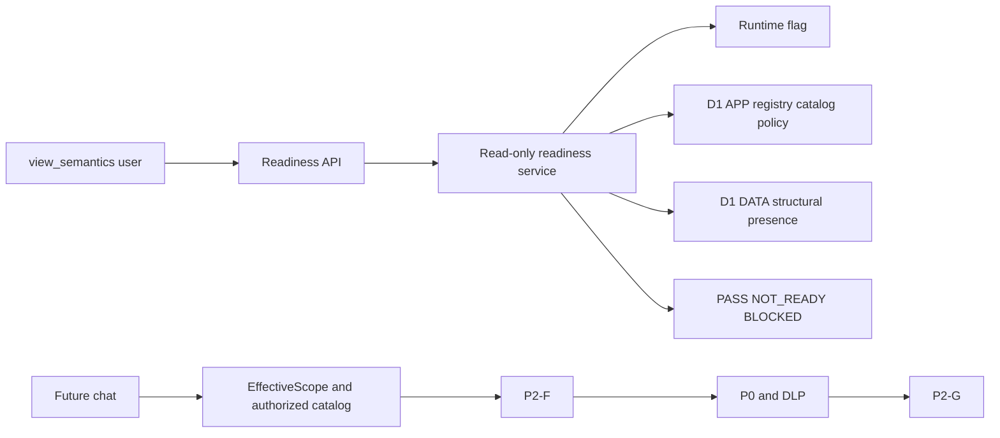

# QueryMind P2-H — Semantic Runtime Activation Readiness

P2-H adds a deterministic, read-only activation readiness gate. It does not
enable `SEMANTIC_RUNTIME_CONTEXT_ENABLED`, create semantic truth, modify
authorities/policies, read business rows, change `QUERYMIND_DATA`, or add a
migration.

The capability-gated endpoint is `GET /api/v1/admin/semantic-runtime/readiness`.
It requires `view_semantics`, does not grant approval authority, makes no AI
call, and does not persist readiness in D1. It returns bounded statuses and
counts only; it never exposes prompts, predicates, scope keys, rows, or secrets.

Platform readiness verifies D1 structure, schema snapshot, P0 policy state,
P2-G evidence contract, and runtime capability. Semantic content readiness
requires an active asset, current approved revision, eligible publication,
compatible snapshot, and resolvable physical sources/dependencies. Operator and
release readiness remain explicit human checks, not inferred user permissions.

P0 remains a bounded tokenizer rather than a general SQL AST parser. Accepted
surface: governed SELECT/non-recursive WITH, explicit JOIN, aliases,
aggregates/expressions, GROUP/HAVING/ORDER/LIMIT and only provable nested
queries. Writes, DDL, PRAGMA, comments, semicolons, recursive CTEs, comma
sources, CROSS/NATURAL JOIN, wildcard exposure, amplification functions, and
unapproved sources are denied. Window functions and unproven dialect extensions
are not activation-approved syntax. A parser replacement is a separate P0
security architecture change.

D1 is used for bounded prepared reads and atomic APP metadata batches. QueryMind
enforces SQL length/token/source bounds, row caps, 2MB response budget,
32KB/25-row preview, rate limits, and a 30-second AI timeout. These application
budgets do not claim arbitrary D1 per-statement cancellation.

Future activation requires human-approved eligible content, schema/dependency
integrity, regression/fresh-clone/CI gates, operator smoke, explicit change
approval, and a rollback Worker. Roll back activation by setting the flag false;
roll back code separately. Production remains flag=false and the next boundary
is governed semantic onboarding, not activation.
